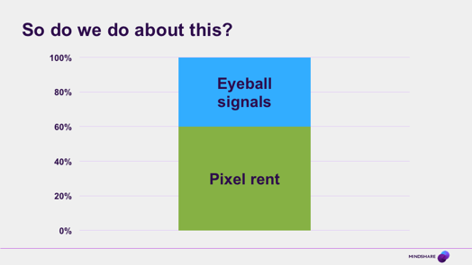

> _2025 Hindsight: The data estate mapping is a bit rough, but otherwise this was on the money. Disintermediation of big agencies. Rise of the platforms. Rising costs of audience measurement combined with falling utility in the face of viewing fragmentation and tail-per distribution of what people watch. Critical nature and scarcity of good quality identity, and specifically cross-device identity. It's all there. Hell there's even a nod to Google's weakness versus Amazon. Oh and a prediction of the fall of Xandr. Shame I couldn't persuade enough other people to do something about it..._

Hello, my name is Sameer. My background is mostly in strategic planning and I work in the Worldwide team in the Insight area. Over the past year or two I’ve been collecting some observations that I'd like to share with you. I think they give some strong hints about where we’re going and what we need to do differently, but I'd love to hear your thoughts, so if I say anything you agree with or disagree with, in the spirit of fight club, which is the spirit of thinking vigorously about our future, please let me know.

# Why we exist

But before we get to the future, I’d like to start by looking back. When I do inductions for new people in the office I always ask them why we exist. Not in some deep philosophical sense, as I usually save that kind of talk for the bar, but why we, corporately, media agencies exist.

They are generally young of course, and few of them know.

Most of you in the room today will remember, many better than me, why we exist, but I think it's worth us all reminding ourselves that we were born of scarcity; born in the brutal fight for a scarce resource, because there is another fight coming, and I think it is going to be the fight of our lives.

At that time, publishers had control of the scarce resource. In this case TV airtime, that was in ever growing demand. This meant they could charge higher and higher prices because, frankly, no one was there to stop them. In the end the only way advertisers could regain some power was to pool their money. It didn't come easily to a lot of them, especially the larger ones, because of the way the market had historically worked.

In fact it was the smaller clients that went first, gathering together in the shelter of the bucket shops – but the logic of scale, once it got going, was unstoppable. As those of you who lived through that period of rampant TV price inflation will know, that's the reason we are all here today. The reason Mindshare, and ultimately GroupM, were born.

# Since then we've thrived

And hey, we’ve all done pretty well. Just 10 years ago, the big media groups controlled maybe 50% of global media spend. In 2013, 70% of all media money spent worldwide was spent out of one of 6 big groups. Now I don’t have the real figures, those are just RECMA, but even then, to go from maybe 150 billion of client money handled in the top groups, to 300 billion -­ that’s not a bad record.

# Powered by Audience Measurement

And one of the things that’s amazing when you stop to think about it, is that all of that flow of cash, all those billions of dollars, travel from advertiser to publisher on the strength of a tiny bit of money that we spend on measurement. Media currency information is all around us, so we tend to take it for granted, but the structures of the JICs and their thoughtful methodologies and their weighting and their systems for accessing their data are pretty amazing things. It is independent data, that everyone agrees to use and to pay for, but in reality it’s more than that…

# Tiny but Mighty

It’s like a giant power transistor, where thumping amounts of current are able to flow because of a tiny little trickle of information fed in the right place. Any of you who have built or repaired your own amplifiers will immediately recognise this as a power transistor of course, but even if you haven’t, look at how tiny the base wire is, compared to everything else.

# Which costs us nothing

And it really is a tiny cost. We might grumble about them, especially when the systems are down, but the contracts for a BARB or any other TV audience measurement system, even with all the fancy stuff they are adding these days, are in the low tens of millions per country. They’re under pressure at the moment for reasons I’ll come on to, but on the whole, these systems probably cost much maybe 1 or 2% of the total amount of money that is traded on the back of them.

# Because, statistics

And that in turn is down to the magic of statistics. When the screens can only show one of a handful of things – a few thousand programmes and tens of commonly watched channels – you don’t need to be able to measure all those millions of viewers. You just take a sample and scale it up to represent the total population. Yes you have to fiddle around to make sure it is reliable and representative, but through some independent currency research a few thousand people can be used reliably to represent millions of others just like them. It’s probably one of the most highly leveraged examples of statistics to control real money that I’m aware of, and one of the earliest examples of large scale ‘behavioural’ research

# But now there are more screens...

We go on and on about the rise in mobile, but it has happened so staggeringly fast that it hasn’t really sunk in yet. So I think it is important to keep going on about it. Even in the past couple of years, the number of addressable screens per head in Europe has gone from somewhere between 1 and 2, to between 2 or 3 per person.

Now that might not sound like much but bear in mind that that is a really gross average across the whole population – all the ageing European grannies and granddads are in that statistic, and we’ve still reached nearly three screens per head in the blink of an eye. People are desperate to have this stuff. And it isn’t zero sum. I mean, there is some substitution of course, but as far as we can tell, the total amount of screen time we are cramming into every day is going up and up.

# ...lots of screens

Online time for the world (or at least the 2-­3 billion people who have any money worth mentioning, so half the world in reality I guess) has gone up, according to our own Interaction data, from 2.5 hours a day to over 3.3. These bits of glass, these glowing rectangles, are so compelling that we’re finding nearly an extra hour every day to stare at them and we’ve changed our habits that much in just four years. Just to put that into context, it took American dads over FORTY years to find the time to do an extra hour of housework a day. But an extra hour of screen time? No problem.

We’re now all surrounded by lots of little bits of computerised glass. And this changes the game. Because when all the screens are showing different things at different times, you can’t take samples anymore because they won’t be representative of what’s going on.

# Which breaks currency independence

So now the people with the best measure of what’s going on all those screens are the people who control what is being put on them. In fact, the only people who can actually measure what is going on are the people who are putting those things on those screens. The people with vast, consumer-­facing businesses that spend their time developing stuff that people like looking at on all these bits of glass.

I like to say that these people have actually beaten the research panel guys at their own game. When I have a Kantar people meter in my home, I click a box to say I give them permission to use my data, and they give me some loyalty points I can redeem, for a toaster or something like that. With a Google people meter, I click a box to say that I give them permission to use my data and they give me Gmail. I like that trade much more, and so do billions of other people. And if you think that’s silly and Google don’t actually have a people meter, what do you think the millions of Nest thermostats out there are doing?

# And gives platforms more power

And of course the main impact of this loss of currency independence is that it gives those publishers much more power, and the same power (or at least some of it) to any other publishers who are integrated with their systems. And that doesn’t just mean some of the traditional media brands like the NYT or the Guardian – it also means every 16 year-­old app developer who is putting the finishing touches to their magnum opus, and decides to make some money from advertising by connecting to one of the major advertising systems. In a few clicks they can make their inventory and their data available to Google, and effectively benefit from the scarce information that Google has control of.

# What do you pay for an 'impression'?

One way to understand it is to look at the breakdown of the media cost in a typical programmatic buy. So where the slide before earlier was all European TV ad spend, this is the cost of just one impression to one person on one screen. I love this example, because in going from the extreme macro to the tiny, micro, we can see a glimpse of our future. In programmatic-­world, everything gets a separate price, and we can split them all out. Now we see a few things here – there are the little mosquito bites of cost that different players take along the way for verification, adserving etc, but look at the two biggest elements of the cost: there’s a chunk of money that goes to pay for the actual media space itself, but almost as much money goes on the cost of information about who is looking at that space.

# Renting signals as well as pixels

So instead of one media cost…

What that means is that fundamentally there are now not one, but two major costs to think about when buying media. The cost of the inventory itself – the rent that you pay to light up the pixels on the screen and vibrate the speakers – and the price you pay to know who is looking at that screen. These two costs won’t always be as neatly, explicitly broken out as they are in the programmatic example, but even in media costs that look like one number (your Google search CPC for example) there is another cost hiding in the shadows. 

In the old world, when most of the screens could only show one of a handful of things, the scarce resource was just getting onto that screen. There was only one cost to think about. And we got very good at doing that. Our media skills are honed to think about pixel rent, and a lot of our clients and their procurement people are trained to think about it as well. All of the stuff you’re hearing now about viewability and fraud (and well before that the idea of agency-­side adservers to check against the publisher server) – is all pixel rent thinking;; we are all pixel rent ninjas.

Which is why we all laughed at this – it’s a classic example of pixel-­rent thinking.

But the trouble is that people looking at the screen is just not the scarce resource any more. In fact, as every month goes by, and every 120 million more smartphones get sold, inventory itself is getting less and less scarce all the time. There are more pixels in front of more eyeballs every day, happily ignoring the lover on the couch beside them.

Where viewability, waste and fraud are the things that we fight over in pixel-­rent world;; when we’re talking about eyeball signals, identity and objectives are the defining battles. Asking ‘Did I reach people?’ is pixel rent; asking ‘did I reach the right people?’ is the eyeball cost. In fact; while we’re doing all our haggling over the number of seconds in-­view and the percentage of the ad that can be seen, the biggest waste of client media money in many markets is not from fraud and out-­of-­view impressions at all.

Even if you take seriously some of the claims that are out there about how many ads are seen only by robots, or hidden behind other ads and so on, that is not the biggest way we are wasting client money.

No, the biggest in many cases will be the money we burn putting impressions on one of somebody’s screens when we’re already paid to show it to them on two of their other ones. Anything between half and two thirds of campaign money could be being wasted like that depending on the market and campaign and stuff like that. I asked a reputable data provider to give me the universe size for rich people in the USA recently. It was a good company, with a good source of income data behind them. The answer they should have given me was around 30 million people – about ten percent of the US population.

Instead they gave me something around 90 million people – because the way they count, they were counting every screen that those people had as a separate person. OK, so it’s nothing on the HHCL classic, but If they were minded to, this is the kind of thing that Facebook could say to criticise us and the way we buy online. They won’t do that (or at least won’t do it so explicitly) but the important point to remember is that the scarce resource now, is not the pixels, but the information that tells you whose eyeballs are in front of those pixels, and on the billions of other similar (but unfortunately not identical) screens like them. And this is not going to go away. Ironically, the more adaptive and the more targeted we encourage clients to be in their marketing, the more we increase demand for something that we do not have.

And the people who do have control of that scarce resource are the big web publishers of the 21st Century – chiefly Google and Facebook, which is fundamentally why they have been able to grow so fast. In the same time as it took an entire media industry, that employs hundreds of thousands of people, to grow by the same amount, Google managed it with a few tens of thousands of people and the right data. The people in those companies have been thinking about it like this for years now and you can see it in everything they do. All the time they are acting to lock-­down more of what they have -­ to preserve the scarcity of any signals that might help someone target media -­ while partnering with, or sometimes acquiring people where they need to access eyeball data that they lack. So to finish, let’s take a quick tour round some of the data estates to see what they have built

Mapping these estates is an inexact science that makes the Mappa Mundi look incredibly precise. We have to go on hints, leaks and hearsay to get even a vague sense of what is going on. In our favour though, is the fact that the things collecting the data are large consumer-­facing properties, so by thinking hard about what data these things generate, we can shed a bit of light on the gloom. All of the numbers I’m going to show you are very crude estimates – please don’t quote them, hold me to them, or pick a fight with me about them – but if you have better estimates then please share them with me.

I’ve been trying to come up with a simple way of representing all the different kinds of signals about eyeballs that can be collected. I still haven’t come up with something that captures all the different dimensions, as there are all sorts of complexities to take into account, but hopefully this is a simple enough scheme to be going on with. It records four main kinds of data – stuff about your core identity, the WHO, stuff that are SAYing, one way or another, by interacting with a machine and typing text into it, or even, these days, actually just speaking to a machine. Then there is stuff about your offline behaviour – things that you do in the real world, which are usually keyed to something about your address, so stuff that has a billing relationship (and therefore your credit card number) will tend to go here too. And not least, there are the online behaviour traces that you leave which can be tracked in many different ways as we hopefully all know by now.

So looking at Google through this lens we see that they are of course hugely strong bottom right. Obviously they have click tracking to see which of the sites you actually went to. And in this they are helped by the tendency of lazy people everywhere to search for the site they visit and then click on the search result rather than go straight to the site – something that gives Google a broad idea of which sites are being visited if not the detail of what they are doing there.

A lot of this data though, comes from sources apart from search. To pick an example that hopefully everyone knows by now, the social buttons that are all over the web, phone home to tell what sites and pages you’ve been visiting. And although this is weakened in Google’s case by the smallness of Google Plus (top left) they are always thinking of creative ways to do this. Whether it is providing free high quality DNS services to people, or, my recent favourite, using the free fonts they provide to some websites in the same way as well.

And that’s before you get into the vast amount of data that they can probably glean from the official part of Android, where Google Play services have taken over the device more or less completely even if it was nominally Samsung that sold it to you. And on mobile, still bottom right, they have social logins that (on the basis of the Janrain data) are probably the major part of what Google Plus does for them now, as they are far more popular than the overall active user base of Google Plus as a social network would suggest.

Finally as all of the big players do now, they offer free mobile app analytics that will only work if you wire it deep into your app. Then top right, obviously they have all the search text (both on YouTube – which is more interest oriented – and in normal web, image and maps searches) plus Gmail as an indication of what people are saying and seeking. Top left we see probably the weakest area for Google – they have a patchy sense of Who you actually are, scraping together some Chrome logins and Google Plus profiles – and bottom left, again we see some weakness.

Mark Andreesen famously tweeted that he didn’t understand why Google had bought Nest but maybe there’s a clue here. Nest’s privacy policy changed pretty fast after the purchase, and I can’t help but suspect that this was because they really wanted to connect up all that lovely in-­home device data and actual name/address etc that they are probably struggling to get at scale from Google Wallet or Play in their current form. And just recently in the press, there was a story that they are working on a ‘buy now’ button, again to try and learn more about what goes on in this quadrant, and compete with the likes of Amazon, who are obviously strong in purchase data.

Almost as interesting for Google is a look at the things they have prevented from leaking out of their data estate over time. Some things went against the long-­standing gentlemen’s agreement of the internet about what you should do when you are sending someone to someone else’s website. Google, like everyone else, used to send a Referer (the mis-­spelling is a mildly interesting historical accident) that would tell you what people had been searching for that led them to your site. Google decided that this was too commercially sensitive for them to release and they stopped doing it.

Similarly, every time they make a big push for ‘encryption everywhere’ or something like that, they are the ones to benefit most as it cuts out people like Hitwise who used to make a living by eavesdropping on un-­encrypted web traffic as it passed through your ISP. The most recent example of this is encryption for ads, which they said was ‘to stop people working out what you were interested in by looking at the ads which were being targeted to you’. This is of course nonsense. The reason they’ve done it is to stop the panel research companies (who are neutral third parties) from building products that can track advertising for a range of clients and compare them side-­by-­side. They have even removed some parts of their API which could potentially have been used to reveal which partner sites they are working with for advertising purposes. This could of course have been routine maintenance, but when I saw it happen, the conspiracy theorist inside me saw a pattern.

Facebook, after its near death experience a few years back, has been playing a very smart hand. Partly because they made the transition to mobile much more successfully, and by hollowing out large chunks of the time we spend on smartphones, Facebook has made itself an indispensable data partner in the new world. They now have as much of a role in sending traffic to websites as Google does (more in some industry verticals, especially News), and they have much higher quality, larger scale identity information across all the devices people own. This means they can bridge people who have some Android and some iOS screens in a way that neither Apple nor Google can replicate. In many ways Facebook is the cuckoo in both their nests. I read a good example of this recently. Some of the announcements of things that they want to do with their iOS apps would involve a breach of Apple’s App Store terms and conditions.

Now it may be that behind the scenes, Apple are negotiating with them about this, but from the outside we all know that if Facebook choose to take it to the wire, Apple would be unable to ban them from the Store. The FB app takes up at least 20% of time spent on smartphones just by itself, before you start to count Messenger or the articles that people are reading because Facebook sent them there. And in case you think that’s foolish of Apple, we’re doing it too. We have all settled on Nielsen’s Digital Ad Ratings product (used to be called OCR) as our audience verification tool of choice, but it is of course based entirely on Facebook’s panel. Nielsen are working hard to move beyond Facebook as a source, but the data they have are pretty compelling. Let’s look at what they have here…

In the wake of the Verizon AOL deal, I thought it would be worth putting up a mobile operator. The one with the biggest single customer base is Vodafone, so they’ll do as an example, but as this chart shows, the operators are single device identity platforms which, by themselves are not massively valuable, but could be when combined with other things. Now if we all had just one screen and everyone used it solely on the network of their mobile operator, they would be in an extremely powerful position, but as long as people have multiple devices, and as long as wifi dominates, they are kept somewhat in their box.

Verizon were doing something recently that is worth mentioning, called header enrichment. Basically they were taking the web traffic of people and adding some extra identifiers to it as it passed through their network, to identify what kind of person you were to the people receiving the traffic – in this case the Turn DSP. This meant that Turn and all its partners could re-­create all of their cookies even if they had been deleted, making the rest of their data much more stable because it was built on a more solid identity. They stopped doing it when it was discovered, but other things will doubtless take their place – the opportunity to shore up the weaknesses of a cookie based approach are just too large.

They also have potentially more offensive things they can do. There was a report in the FT recently that at least one operator has installed ad blocking software in its network, so that they can remove ads, save bandwidth and also hold some of the publishers to ransom, but it remains to be seen if that was just a well-­ timed leak by a manufacturer of adblocking equipment.

And so we come to our own picture. And as you can see, it isn’t blank, but there are only really two really large platforms to conjure with. Xaxis (and Connect in due course I guess) and iBehaviour. Both of these have limitations.

iBehaviour comes out of the database marketing tradition, so it is essentially a combined online/offline data co-­operative, similar to people like Datalogix, who you might have heard of, as Oracle bought them recently for about three times the price that WPP were willing to pay. iBehaviour is currently in a handful of markets, and in most of those has at most 60% of the population profiled. Much of its data is household based rather than truly individual, but it is the horse that WPP and GroupM are backing – as shown by the focus that Harvey Goldherz is giving it, and also by the move of Mark Read to take charge of Wunderman where it lives.

Xaxis, by contrast, and Connect, gets to see exactly what everyone else sees if they play in the major exchanges at scale. That’s not to say it’s bad – far from it, they probably see most people on the internet on most days, but there are again limitations, and it certainly isn’t, by itself, a strong source of sustainable competitive advantage. They only see people on the pages which carry advertising that is auctioned, so they will have a skewed view of what people are interested in compared to Google and Facebook. As far as I’m aware, neither of these systems are fully connected to each other yet. Once we have some kind of link, things will get a bit more hopeful for the iBehaviour markets, but expanding beyond those will be a slow burn I suspect, because co-­ops take time to start in new countries.

I don’t want you to be too gloomy. A number of things are already happening. As you’ve seen, the WPP data estate, while it isn’t a patch on those of the big guys, is getting bigger and we will continue to develop that. And where we can’t get the data ourselves, we’re trying to extract it from other people. My understanding is that GroupM are shifting their trading strategy, for example, to focus more on getting data out of them rather than rebates. The WPP Data Alliance is also making some smart deals to connect us to their data source in ways that strengthen our hand. And a lot of these big firms have blind spots in one market or another – China most notably for Google and Facebook, although Apple are making good inroads there because they are going via devices not services. But there are three things that I think we should be doing better, so I'll end with these. And they all revolve around this idea of eyeball signals.

The first is that we need to get better at thinking about them. As good as we are already are at thinking about pixel rents. As I mentioned earlier, the more adaptive and the more targeted we encourage clients to be in their marketing, the greater demand for eyeball signals will become, so we need to have a handle on that demand. And hopefully the more we have these kinds of conversations, the more we will manage to do that.

The second thing is that we need to know who are the most popular audiences, what are the most popular KPIs? We need to have a better grip on the nature of the demand. I should be able to turn to any of you and ask which audiences are most popular in summer. Which KPIs are top for which audiences. Because the big global online publishers are essentially building learning machines that are observing which clients are seeking which audiences with which objectives. This is not something we can avoid – it’s not like the old argument about putting cost data in the ad server because they already know that – it’s that fundamentally, every time we buy a campaign in any of these media, we have to tell them the objective and the audience – there’s no escaping it, but we should at least get comparably good at doing it ourselves.

Then I think the third thing we need to do is torture test the value of those signals. If we are going to be more targeted to specific audiences and if we want to chase after them, we had better be damn sure that they are audiences worth targeting, because that is what our clients’ money will increasingly be spent on. And it may be that a lot of the audiences we all think we need to buy are actually a waste of time. It may be that a lot of what we used to call media waste was actually working media and reach was a good thing. 

Or it may be that the rabbit hole goes really deep and there are lots of gains to be had from targeting ever smaller groups. At the moment we don’t really know. Hell, we don’t even have some of the basics – no-­one that I’m aware of within Mindshare has done any large scale studies of search effectiveness, so we don’t have a corporate view on the value of those signals beyond what Google tells us, when we should really be holding their feet to the fire.

And if that sounds like too much work, let’s just remind ourselves what the alternative could look like. People in media agencies reduced to flicking a few switches on the front ends of the big publishers, until such a time as they can automate even that.

