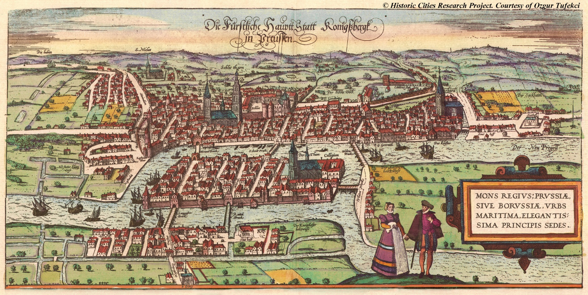
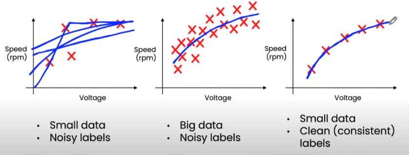
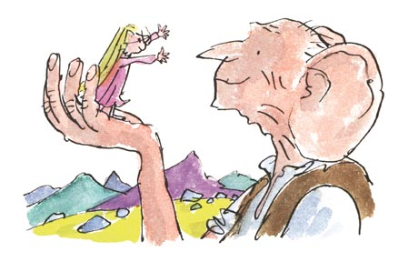
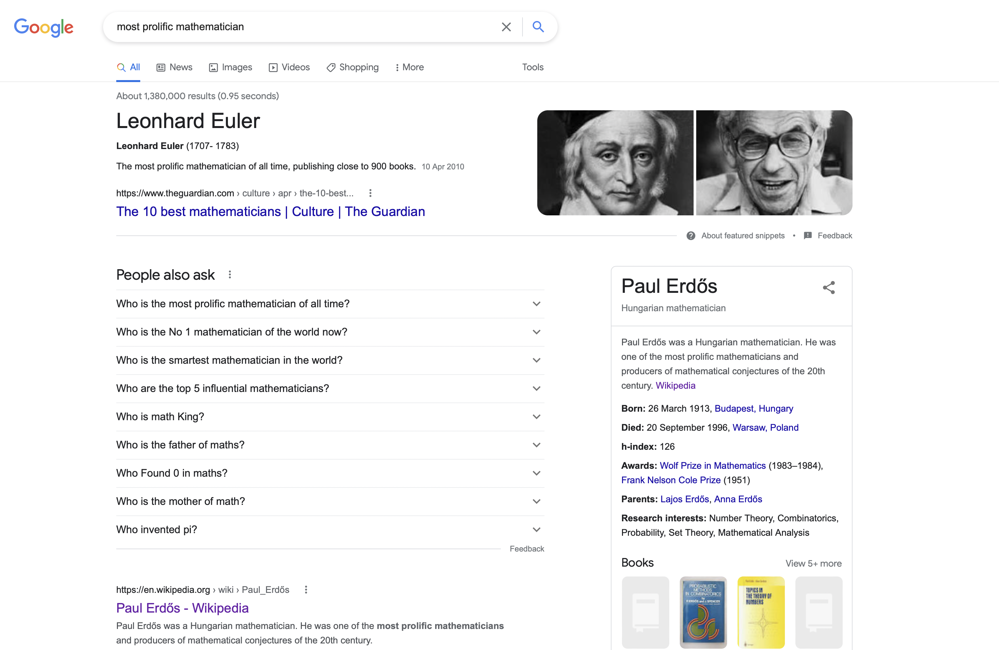
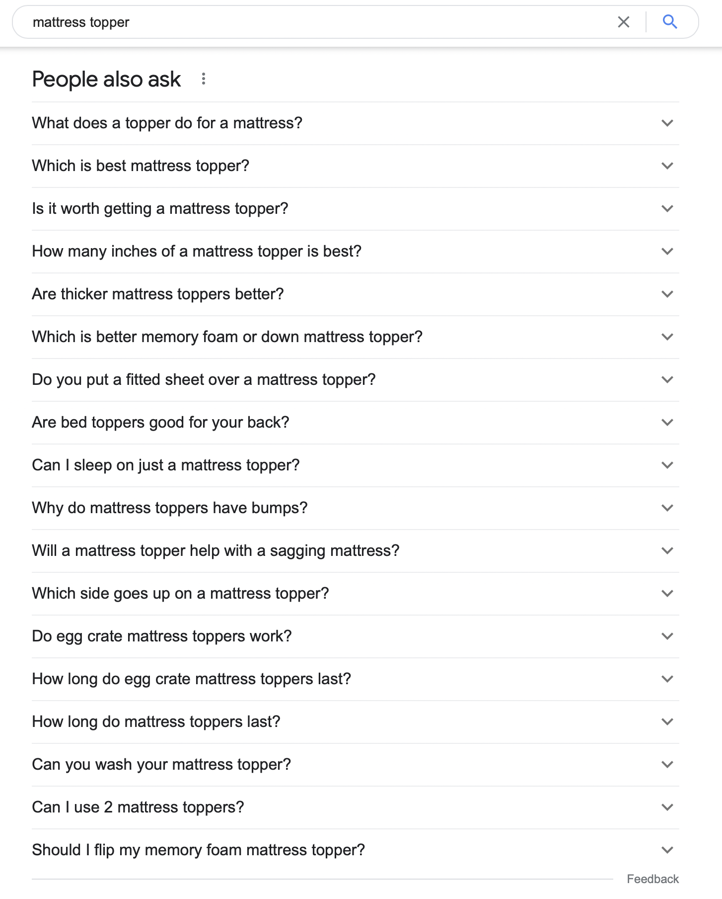
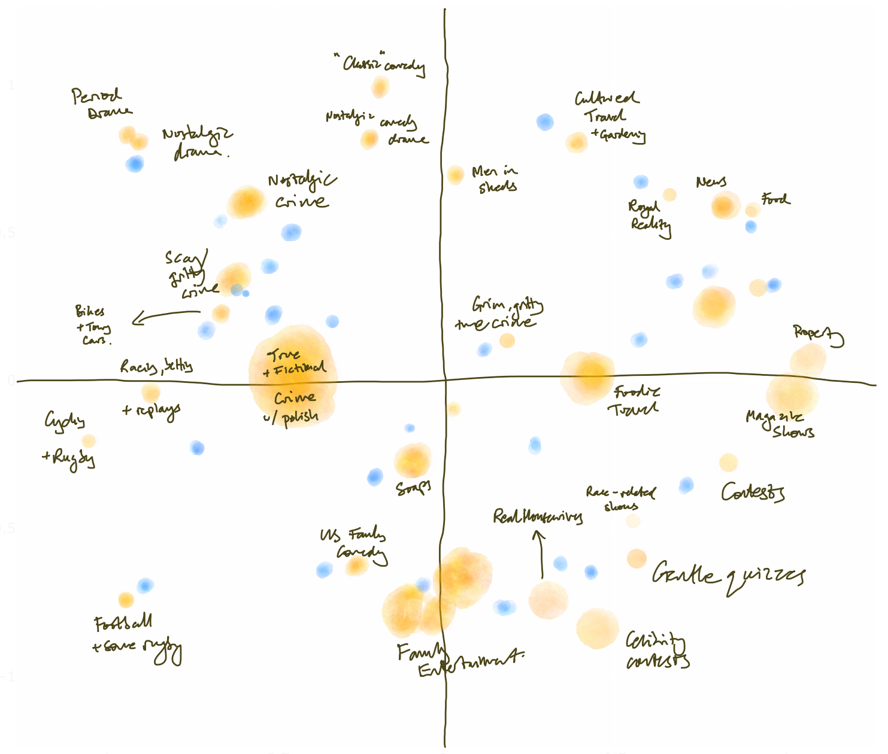

> _2025 Hindsight: I had to resist the temptation to rewrite this much more than some of the older material. Distinct lack of editing, and a very forgiving audience on the sunny day in LA when I presented it at the Entertainment Data Science conference who put up with my terrible time-keeping. The core idea of value from production models still makes some sense I think - if we're seeing a split between large general purpose ones and domain/problem-specific ones, then the latter are worth getting more value out of._

# Collateral Knowledge
Hello hope everyone's feeling OK after last night! I'm Sameer and I’m very happy to be here. The Manchester arm of this conference has been one of the highlights of my professional life, and I always wanted to attend the Stateside version, and now here I am.

It's been great to see some familiar faces, but for those of you I haven't had a chance to meet yet, I guess I should introduce myself.

So. Anyone recognise this building? Or perhaps the bridge on the right, in the foreground?

How about now?

Yes exactly. It is a picture of the old Cathedral in Kaliningrad, which you are more likely to know as Königsberg Cathedral. Yes, the Königsberg of the famous bridge problem.

And the reason I've put this up, rather than, say a picture of my kids, or our cat, is that crossing and re-crossing bridges is what my career has felt like - hopping between different islands of enquiry and seeking connections between them.

I’ve worked at consultancies like the Futures Company, that predict the things tomorrow’s consumer will to want. I’ve worked at advertising agencies like Wunderman Thompson, making advertisements that supposedly persuade people to want those things. I’ve worked at media agencies to get those advertisements in front of people using different advertising products, and I've worked at media owners to help advertisers use those ad products better. I was at Google for 2.5 years in the UK sales org, and my most recent island-hop has been to ITV.

---
For those that don't know it, ITV is the largest commercial television broadcaster in the UK. On the studio side we are inventors of formats like Love Island and BGT. And we've historically used that unashamedly populist entertainment to drive large commercial audiences.

My day job there is to run a team developing scalable advertising measurement products, and in the course of my travels, I've been lucky enough to look after a range of insight, analytics and data science teams - which has meant travelling between the islands of small scale qualitative, survey and UX research, all the way to the swampy archipelagos where logs of billion user scale behavioural data can be found.

And perhaps more unusually I've travelled from being someone whose job is to influence creative people and help them come up with better ideas, to a job where my role is to influence data people and, well, help them come up with better ideas actually.

The funny thing is it’s a remarkable similar task. In my old world, my measure of success was whether the creative team was rushing back to pick up their pens and paper to start scribbling after a briefing. These days, success for me is when the data scientists rush off to grab their whiteboard markers and keyboards. Mechanical keyboards of course.

The trick in both cases, is framing the question in its most pungent form, in a way that gives hints towards possible solutions. It's the difference between asking 'why is the sky blue?', which is an ok question, and asking 'why is the daytime sky not black?' which immediately gets you in the right frame of mind for a good explanation.

---
And the question I want to pose today is:

> How can you (and why should you) surface *unexpected, implicit knowledge* from your large, task-specific models to help people in your organisation make better decisions?

I'll just let that sink in for a second.

Unexpected implicit knowledge.

I want to talk about the things that our models know, and about how to give more humans the benefit of that knowledge, by taking a bit of time to extract it for them. By enabling a conversation between them and the model if you will. (Not a sentient conversation obvs - sort Blake.)

And the reason I stress unexpected knowledge is that those humans generally have pretty decent folk theories they use to guide their decisions. If you market sofas for a living, you'll usually have good instincts about how people buy them.

Some of the less productive engagements between data people and decision makers happen because the data people uncover things the practitioners already knew about. We do plots of geocoded Tweets and discover the existence of Paris.

But if we can surface something for those people that is both true *and* new; if we can change the way they think, that will increase our sphere of influence in our organisations, which was a key theme from yesterday.

And more ambitiously perhaps, I think we can start to change the way people relate to data. There's a lot of talk about data-driven decisions, and I have to say honestly I think it's a terrible idea. Data by themselves don't tell you what to do. And people often forget the golden rule of data analysis, which is that if it looks interesting, it's you've probably made a mistake.

But if we can cube our models for people rather than cubing data, if we can enable model-supported conversations rather than naively data-driven decisions, we will raise the quality of the inferences people make.

---
# Desired Outcome:
## *Invite questions of your models from people outside your {fn, dept, org}*
So to be successful with this talk, I want to have persuaded you to do three things when you go back to your day jobs. Three things that together will take you half an hour - maybe an hour tops. Sound fair?

1. The first thing I hope you'll do on Monday is write down a list of all the really big, task-specific production models in your business. Rank them in size if you like. They'll mostly be user facing ones I'd guess, but if not they're likely still processing user data.

2. The second thing I'd like you to do is write a few sentences about each of those models. Specifically, I want you to write a description of what a human would need to know to be able to do that model's job well.

3. And the final thing I'd love, is for you to send that list to as wide a range of less-technical people across business units and functional roles in your firm as you can manage. You do know some less-technical people right?

And your subject line is simply this. "If these models could talk, what would you ask?"

That's all I want. An hour of your time. But I should probably explain why. And to do that I need to reflect a bit on where we are today.

---
# Multi Mod{a,e}l?

Ok so this is a gif taken from a recent blog post for Google's PaLM model, which neatly illustrates the point that as big models get bigger, they can tackle more problems in more domains. These kinds of model are getting lots of attention these days. (And I don't mean self-attention lol.) Even the Economist has covered 'Foundational' models that can be used for multiple tasks. Multi-lingual models. Multi-modal models. Models that, with a few shots, can learn to solve new problems, in novel settings.

Like many of you, I am following all this with huge excitement. Seeing ever more difficult tasks cracked by the same bit of kit. Things that seemed improbable only a couple of years ago are now straightforward. Forget the AI winters, welcome to the glorious AI summer, where we can sit on the sand under PalM’s tree while it tells us jokes. Further down the beach GPT-3 is explaining how pieces of code work, and Dall-E 2 is busy drawing quick fire caricatures of tourists in the style of 19th Century Scandinavian children's literature.

---
## Go {big,{home, small}}?

But it's not all towering, planet scale models of course. There is value in the opposite direction too. People are making small, task-specific models with compact, bijoux data sets. Andrew Ng, for instance, has been popularising the idea of data-centric AI, where, as long as you spend time cleaning them, modest datasets with modern techniques can yield huge amounts of business value. So again we can realise the potential of ML in new domains to answer novel questions.

Seems like we can't lose. Either we benefit from the emerging commons of the giant models, bending them to our purpose, or we build tiny models specific to one task. Go big, or go small, either way, you’ll strike home.

Well, maybe, but between these poles, I think there's another way of getting more value out of the models we build and out of the work we do as a community.

Specifically, between the sequoia and the bonsai, I think, we should be asking more questions of the large, task-specific models we look after.

---
## The Big, Friendly Giants

You know the ones I mean. The gentle giants that solve some difficult but important problem for your business. The ones you feed vast quantities of data but would never use for transfer learning. The ones where the internal website talks proudly about the billions of inferences per second delivered to the rest of the business. The models that make lots of money, but rarely get their own blog post. Funnily enough, a lot of the models in this conference. The recs engines, the fraud models, the lifetime value predictors.

I think the sad thing about these models is that they don’t get enough love. Oh sure, we guard them against data and concept drift, we tend to their pipelines and nurture their features, but other than that they are left alone or, worse, discarded when some new approach comes along to beat their previously SOTA performance; at which point we cruelly cast them onto the digital scrap heap.

But in some of my work in recent years, I've found these gentle giants have a lot more to give, because they contain deep, implicit knowledge about the domain they work in, which other people, making decisions in the other parts of the business (and sometimes in other businesses), find enormously helpful, once they are able to access it.

---
# 1. Pinterest circa 2015

Here's a simple, maybe even whimsical example of what I mean.

So this is a map of Pinterest circa 2015. Specifically, it's a map of the topic classifications which it used to show on site to help people navigate. You know the drill. "Interested in Shaker Kitchens? Well, you might like Farmhouse Kitchens too."

All we did for this project was scrape the graph of related topics, partition it and plot it. But it became an artefact people found super useful.

Pinterest sales people use it as a way to talk at a high level about the strengths of their platform versus other media owners.

Advertisers found it useful to figure out what sort of content they needed to be producing to be seen in the right places.

I remember working with one particular advertiser that sold a lot of products for the home. They were already making content for Pinterest, but by plotting it on this map we showed they were not showing up where they wanted. We helped them work out what they needed to be producing instead. More about Shaker Kitchens as it turned out.

And though I didn't get to talk to them during the project, there would have been community managers at Pinterest at that time worrying about where they should focus their efforts to recruit new creators. "Do we need more nail artists? More tattooists? Or indeed more kitchen designers?"

My point here is that something which was developed purely for the consumer-facing product, actually had many other uses across that business. And all it took, in this instance, was for someone to surface that information in a suitably aggregated and simplified form.

---
# 2. People Also Ask

Another example.

There's a lovely feature in Google Search that understands related questions. As we see here, a question about "Who is the most prolific mathematician?" might lead to questions about who discovered zero or invented pi. (And amusingly, might lead to results about both Erdos and Euler, although poor Euler gets a raw deal as that picture on the left isn't him, but Gauss.)

---
# What is a Mattress Topper?

More practically, a search for mattress toppers might lead to questions about what they are, whether they are worth it and how thick they should be.

Now I have to be a *little* cagey about this example as it involves work at a previous employer but I can still give you the gist of it by considering this feature from the outside.

So you might play with it and notice the questions vary by country and some other dimensions too. You might then imagine some kind of model is involved underneath. You might even notice the feature shifts from suggesting what 'people also ask' to what 'people ask next' and conclude that the order of searches is somewhere in the model, and that it might therefore need to consume sequences of searches over long periods of time, probably for a logged in user. You might even guess it would need to be some kind of memory based architecture like, to span the searches for multiple topics that a user typically does.

And if you had a very fertile imagination, you might even conceive of someone enthusiastic from the sales org going and making friends with the eng team responsible for the model, and that, after some initial suspicion (who is this person from sales, and why are they booking time in my diary?), imagine that they would engage warmly, and be offered access to the model to attempt some clustering and simplification of its outputs.

And in this case, the application they got excited about was helping marketers understand more about the digital customer journey hidden in those sequences of questions. By aggregating those sequences we were able to make the customer journey visible in ways that hadn't been done before.

Now a lot of the time, several elements of the journey were obvious to someone who worked in the category. But that was a good thing as it gave them comfort that we had indeed 'done the math'. But once they gained confidence in the model, they started to notice sequences they hadn't considered. They saw more 'upper funnel' questions and behaviours from different domains were leading people into buying their category. Selfishly, for my old role, that also meant they bought new search keywords that they'd previously have ignored or ruled out as too expensive.

---
# 3. Old Recs Engine

And from my current work here my last example. It's a simple one. In fact it's so simple I feel shy about presenting it. We heard yesterday and will hear more today about the state of the art in recommendation engines. Complex feature pipelines. Multiple sources from metadata about actors, directors and cinematographers to video genomes that classify story archetypes.

Now the recs engine in ITV Hub, which is our online service, until fairly recently, was nothing like any of these.

It was a good old-fashioned SVD, based purely on user behaviour. Nothing more, nothing less. So if you watched a lot of Show A, and Show B, and people who watched Show B watched Show C we'd recommend that to you.

That was old when the first of these conferences happened, let alone now in 2022. You're probably sitting there thinking, 'but what about cold start?' Or 'what about pollution of the model from home page editorial recommendations?' and you'd be right but for my purposes it didn't matter.

---

We dug out the old model. The one off the digital scrap heap. And we repurposed it. We took the SVD, and clustered it to produce groups of shows and groups of people

We looked at the people who watched certain shows, and the shows which watched certain people (if that doesn't sound too Black Mirror) and looked at the relationships between the two, and then we arranged for the two sets of clusters come together in a single conceptual space.

We didn't have to do any data engineering, or even much tuning of the original model - instead we benefitted from all the work that had already gone into it which was otherwise about to be junked.

And while we might have moved on in terms of our consumer-facing recommendations, what we're finding is that this old model gives us a great overview of the patterns of consumption of our content. And in fact, because it is based purely on human-driven relatedness signal, rather than anything from the nature of the content itself, that makes it useful for the sales team trying to sell deals around that content.

So rather than grouping by the conventional categories of Entertainment, Sport, Drama, we can unpick those and start to tell more stories about the overlaps between our shows.

Now **the recs engines** that a lot of you have, implicitly know a lot about more the fit between audiences, shows and context (time of day etc). And I *guarantee* you have multiple teams within your organisations who would love to have an understanding of that, to better guide their conversations and decisions. And if we can do get value out of it with a super simple model like ours, how much more would you be able to do?

---
## Lay foundations

So I'm going to finish by talking a bit about the lessons learned from doing this kind of work.

Fundamentally, to get this value out of our big task-specific models, we have to build a bridge between the models on one island and the people on other islands in the business, wrestling with decisions.

Bridging these two is not easy. For every example like this I've had multiple failed attempts, where the analysis didn't land, or the model owners didn't want to play.

On one island, the people who need answers also have prejudices. They have expertise, but their mental model of how to interact with data is flawed. If you ask them what they want, they want a faster horse. Bigger tables of raw data. (Or for you to do the analysis for them.)

At the other end of the bridge you have the model owners. The challenge there, is they are usually locked into a very intense, focused role that doesn't allow much playtime. If you're building towards them from non-technical island, it can even be tricky getting them to talk, but when they do, there's often a lovely response.

To get them to engage, you need to reframe the question from the other islanders into something they find motivating, that doesn't require too much work, reuses resources they already have and maybe brings them something new. My trick was to have some rogue data science resource, and offer to do some of the work for them, so all I needed in the early stages was access.

---
# Create unexpected connections

And then, the challenge is to find a way to build the bridge. To coax answers out of the models in a form the other islanders can make use of.

Now from a technical standpoint there are lots of ways of doing this. And the good news is that you're probably already doing them.

Maybe you've had to build a user-facing explanation feature - 'why am I seeing this?'. In which case great! Aggregating those reasons and surfacing higher order patterns in them will be helpful for someone. Or if haven't done it yet, then you can raid the interpretability toolbox which some enterprising internal group has built for you.

You could re-use the tools you now have for testing model bias. Google for instance has a lovely Language Interpretability Tool, usually used to help other people grasp what the stochastic parrots are and aren't doing. But if you've got a model that works with words, dropping it into that will be helpful to the lay people.

You could systematically surface surprising counterexamples humans should learn from. I always think about that surprising move AlphaGo made all those years ago in game 2. Move 37 I think it was. But if you ran a search for pivotal moves that don't typically occur in human games I'm sure you could surface a lot more. You could change the Go playbook.

The equivalent in the entertainment world is to surface deviations from some theory. Show how your behavioural genres cut across conventional ones. Show how the patterns of movement in your map data differ from movements in general. Define the boring and obvious, and subtract it from your model so that what you have left, no matter how strange, must be the truth.

And the connection, the bridge, when it works is magical. What happens first is that people spot the bits they already understand. And then once they’ve got comfort with the artefact, they start to notice the things that are equally robust, but more unexpected. And that is a lovely moment. When the humans feel like they’ve learned something from the machines.

---
# Walk with them

OK, but even once you've got your analysis, there's one more hurdle, one tollbooth as you cross. Which is that the audience aren't used to working with you and aren't used to the artefacts you work with. And that gets in the way. So I'll finish with a few top tips on how to get people travelling on your bridge.

1. Make it look beautiful; don't bring along a scrappy notebook with some ggplot or seaborn stuck in one corner. Invest in the tooling to make big, beautiful, accessible, easy to read charts. Get someone to make the corporate template into CSS that you can use with Reveal.js. Tidy up your labels so they are correctly punctuated. It's annoying. It's superficial but it makes a difference to them I notes same way that great giftware increases the perceived value of presents.

2. Or if you can't do that, make it look scrappy human - redraw them by hand, make it feel provisional, and temporary. When you do that you remove it from the world of numbers and scary, spidery plots in another way, which makes them feel less scared of expressing an opinion. Of telling you what they really think.

3. That's also often a good way to involve them in the interpretation - with dimensionality reduction techniques there's often ambiguity; emergent axes that need require interpretation. Use the domain experts to help you do that. Practically, they will be good at it, and more manipulatively you enrol them in the findings.

4. Find examples to highlight and make it real - 'so I was thinking this makes sense because it fits with this idea, but this bit seems strange to me - can you think why it might be like that?' If your data are showing that a group of shows have  something in common because they are all 'intelligent horror' then find some quotes or clips to corroborate. Tie it back into culture.

---
# So about that e-mail...
	1. List your big, task-specific models
	2. Describe what the infinite interns know
	3. Find out what people would ask them

For obvious reasons, this won't be as high-profile, or as repeatable as other approaches. You can't make your task-specific models public in the manner of a PaLM or a GPT-3, nor does this deliver as easily as a pure engineering solution for 'small data'.

But it is an approach that will bring you into contact with other parts of your organisation and increase your influence across it. It will mean you help more people make better decisions more of the time, for relatively little engineering effort. In fact, increasingly, it's probably engineering effort you're having to expend anyway as part of an ever more involved process of validation, testing and bias checking.

In the end it comes back to the nature of the influence we want to have in our organisations. I was mentoring a wonderful, and very earnest young analyst recently, and in our first conversation, I asked her what being a successful analyst meant to her, and she said something like 'I measure my success by the size of my error terms.' Sometimes I worry we're like that - measuring our success by our inferences served rather than minds changed. Maybe sending that email is a good next step.
