> _2025 Hindsight: First, clunky attempt to preach Outcomes on a bigger stage. In hindsight, choosing the premier audience measurement research conference might not have been the best place to do it - asking turkeys to vote for Christmas being something of a faux pas. But huge thanks to Mike Sainsbury and Richard Marks for letting me try. Must have made some kind of impression as they asked me back the following year._

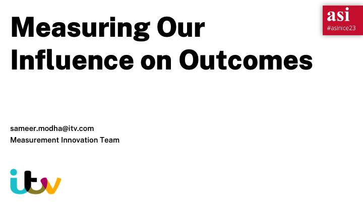

Hello. If you want to know about me, you can scan the code or take a picture and visit the link later. I’m not going to waste time introducing myself because I’ve only got ten minutes and I have some terrible news.

You have all lost someone precious to you. They’ve been seduced from right under your nose.

And if you want to win them back you are going to have to take drastic action.

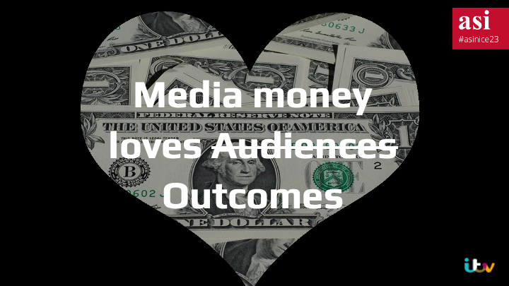
That’s right folks. Media dollars don’t love you any more. They love Outcomes now, and they’ve fallen for them in a big way. 

What do I mean by Outcomes? Well, to borrow Ted Levitt, if Audiences are the quarter-inch drill…

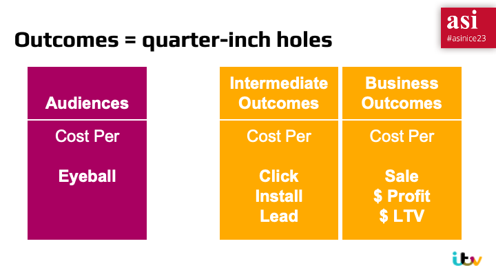
Outcomes are the quarter-inch holes

Advertisers have always wished they could buy results but we've always sold them audiences as a currency instead. We left the outcome measurement up to them. 

Then came the platforms. They found a way to bake outcomes into the advertising contract. You pay per click. You pay per install. 

Payment by results is easy to understand.
I gave Google $10m and they gave me $50m worth of site visits or installs or sales. That's an easy thing for a finance person to sign off.
I gave ITV $10m and I got some TVRs is ultimately harder to justify, at least in relative terms.  

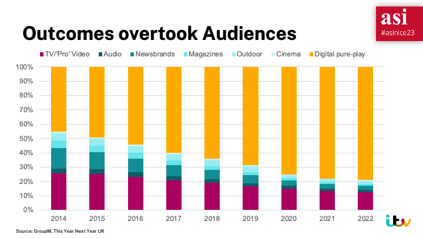
Here is an example using GroupM’s UK data, where the yellow bars are digital ad products and the wine coloured bars are TV spend.

Everyone knows media money has shifted channels over the past decade. 

But what does it look like if we recut this data? Split it into money spent buying Audiences, versus money spent buying Outcomes?

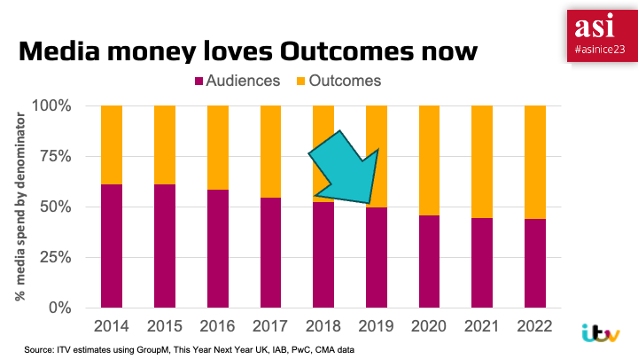
Well it looks like this. It looks a bit better in some ways, because there’s platform money that goes on Audience buys too.

But even then, you can see that Outcomes stole your love away five years ago. Their toothbrush is in someone else’s house now.

If you’re still in denial about your loss, you might point out there's lots of static display in there - everything from posters to banner ads. And you’d be right. 

So let's remove all that, and just look at video adspend.

This is tricky but can we estimate it using data given to the UK Competition and Markets Authority as part of their 2019 investigation.

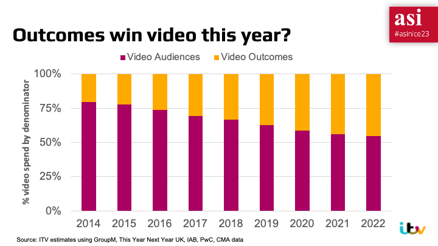
If someone here has better data than this, I’d love to see it, but even on my crude estimates, I reckon outcome contracts will take over half the money spent on video advertising in the UK by the end this year.

And it’s only going to get worse. Platforms are starting to sell incremental lift products and get into ever deeper outcomes. The logical result is the ultimate in quarter-inch holes: buy net profit at a certain Cost Per Dollar.

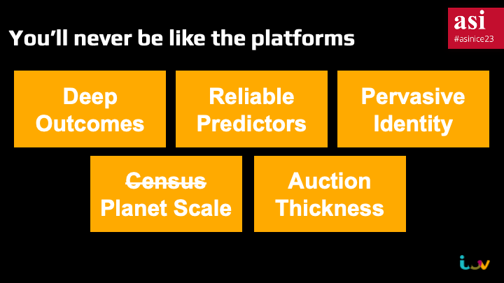

And the tragedy of your unrequited love is that you can’t win them back by trying to be more like their new partner. It won’t work

Just like us broadcasters, you have none of the things you need to even *try* and target like the platforms do.

- You don’t see all the outcomes
- You don’t have predictors of those outcomes
- You don’t have cross-device identity
- You don’t have census scale for any of those things
- You don’t have millions of advertisers to make the auctions work

And I know you’ve been flirting with this – trying to make a bit of money on the targeting side, but it’s doomed to failure for all these reasons.

To win them back, you need to dig deep and remember what made you great in the first place.

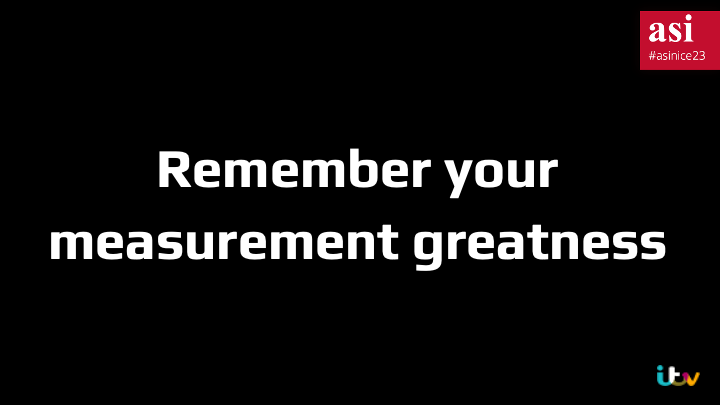

You need to remember your measurement greatness. 
You see, even though media dollars don’t love you anymore, I do. I love this community.
- TAM Panels - you were the original big data, before Larry and Sergey were even born.
- Scanner Data - you were the original clean rooms, managing data so everyone could benefit without anyone risking leaks.
- Split Cable tests – you were the OG of causal experimentation.
You are champions of quality, of representativity, of accuracy. 

But today you're measuring the wrong thing. 

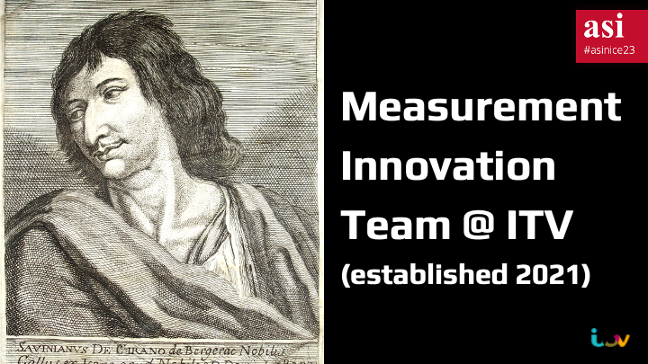

So how can you get started measuring Outcomes?

Well, we can give some pointers. Back in 2021 we created a Measurement Innovation Team at ITV to invent, test and deploy Outcome measurement tools for television. We’ve been doing this for a few years now. I’d like to share a bit about what we’ve been up to, but my key message is that we’re keen to work with you. 

Think of us like Cyrano de Bergerac – we’re here to help you write letters to your love, to woo them back

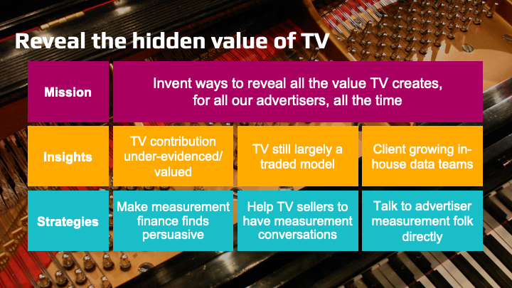

To put it formally, this is our mission

We think TV is like a piano in the orchestra. Making a powerful but subtle contribution. 
We want to uncover all of hidden value it creates.

This is hard. 
The evidence currently isn’t that persuasive.
TV sales people aren’t used to having measurement conversations 
And advertiser data teams don’t expect us to have anything useful for them

And there are only 10 of us - so we work with a wide range of companies in the industry to run proofs of concept, pilots and scaled advertiser trials. 

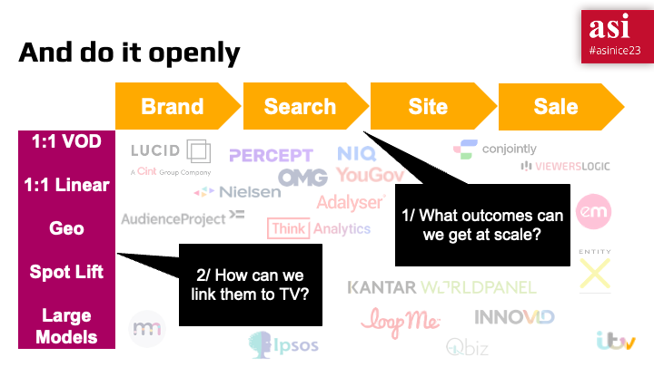

And this is how we do it – we look for outcome sources that we can get at scale. Everything from data on the prices brands get in search auctions to sales data from open banking.

Then we use a variety of methods to link them to TV activity.

And we do it openly. We share all the resources and code we create. We share ideas and try to make connections between companies.

We believe the more that agencies, advertisers and research companies out there are doing this kind of the work –– the better for our medium.

I would love for pilots you run with us to become your measurement products of tomorrow. 

Hell, I’ll even try and persuade my fellow broadcasters to chip in. 

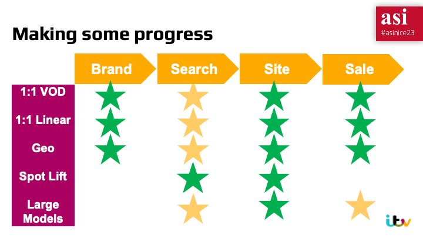

So how have we done so far?

1. We’ve just released a study called the Hidden Value of Peak, which used Viewers Logic’s data for 50 online advertisers to show that pound for pound, peak time is the Duracell bunny of TV advertising – its effect keeps going for up to 90 days, long after other day parts have run out of steam. And we’re working on a similar study for price elasticity which I’ll share next year.
2. We’ve been working on ways of showing impact on search – we’ve managed it using spotlift, but are trying a number of methods, one of which we’ll announce later this yeat
3. In fact we think spotlift is under-rated generally , so we use that a lot
And we’ve developed modern methods for designing and running multi-outcome geo experiments. My favourite bit about that is we now routinely have our sales people asking for anf getting access to advertiser’s web analytics data. Just let that land. Advertisers, encouraged by our sales people, are giving ITV access to web traffic.
4. And we’ve run pilots which deliver lift measurement across both VOD and Linear for brand, site and sales. Total TV measurement if you like – next step is to scale that across our clientbase

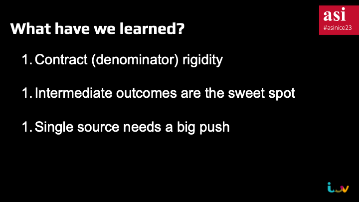

A few learnings to share

First – I’m afraid to say you lot are a nightmare with doing anything new. There are some companies I’ve literally been trying to give money to for years, and they won’t take it because it doesn’t fit their existing pricing structure. 

Second – we think intermediate outcomes are going to be the sweet spot, so investing more there makes sense. It’s financially important to advertisers, and relatively easy to show an effect.

Third – there’s a chasm to cross when it comes to single source. 

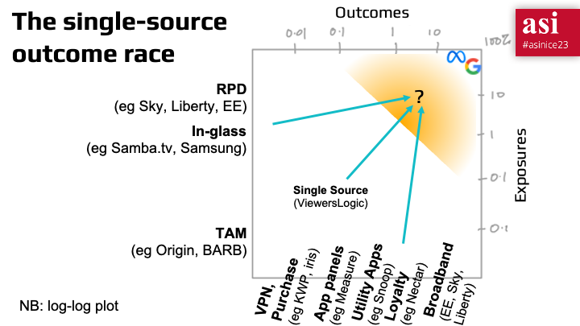

To finish I want to leave you with this chart
It’s a log-log plot so beware of the scale
And you can think of those percentages as approximate population penetration
Obviously the platforms are at the top right, but for measurement we don’t need to get there, we just need something big enough to measure most campaigns
However, there’s a big gulf between that and where we are today. There are some obvious partnership opportunities, and I’d love to talk to people about those and how we can help make them happen
It’s all aggregated in the end so the privacy issues are manageable, but we really need to get a move on. Audience measurement just ain’t gonna cut it. 



And here’s a quick pep talk from Edna to remind you of your greatness. 

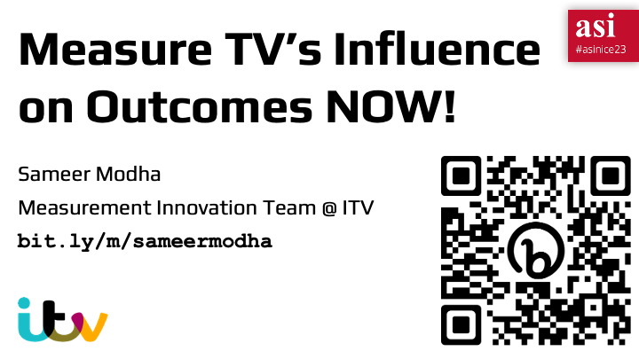

