Three things I want to do today.

1. Persuade you there’s money to be made measuring TV’s best bits; not its reach or attention, but the outcomes it delivers for advertisers.

2. Explain what commercial broadcasters in the UK are doing with Lantern.

3. Give you some ideas on how you too can help give TV the measurement it deserves.

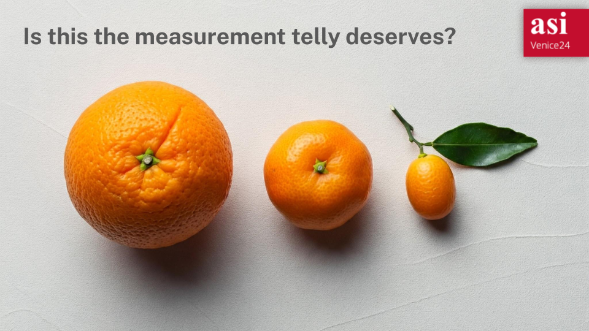

But first, let’s deal with the fruit.

As you’ve heard this week, some people look at this picture and see three pieces of fruit that should be counted equally because, well, there are three of them. Other people think that because it has more juice, the orange, which could be, say, a 30 second TV impact, should count for more than the little kumquat on the right which might be, let’s see, a 2 second video view on Facebook. 

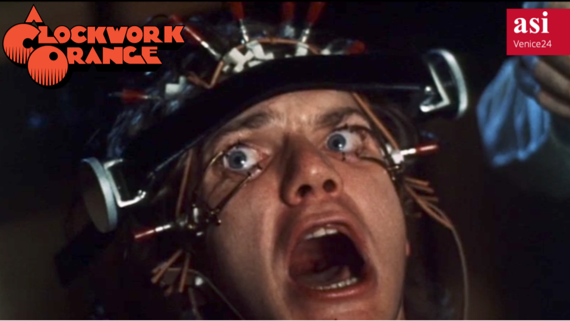

And I. Don’t. Care. I don’t care percentage of fruit consumed with skin-on vs skin-off. If JRC standards for Vitamin C content are unmet (The JRC is the Juice Research Council by the way) I am unbothered. And don’t get me started on the amount of attention mobile satsumas get compared to in-home Clockwork Oranges, the measurement of which is being demonstrated here by our test subject under natural viewing conditions

And as you might have deduced from my question yesterday I don’t believe in deduplicated citrus reach. Because I’m much more worried about holes.

Marketing Professor Ted Levitt once said “the consumer doesn’t want a quarter inch drill, they want a quarter inch hole”. What he meant is that consumers want to buy a benefit. They don’t care about the means of achieving it.

But that is what broadcasters have been doing to our customers for decades. Selling drills rather than holes. Means rather than ends. Eyeballs rather than outcomes. 

It is also why this conference is so generously supported by Nielsen, Kantar and Ipsos. Because most of the money the measurement today comes from eyeballs.  I mean they’ve got effectiveness practises somewhere turning out Market Mix Models, but I can’t imagine it’s more than 5%.

But here’s the thing. If you look at advertiser spend in the UK, outcome spend overtook eyeball spend 5 years ago. In Britain today, nearly 2/3rds of all ad money is spent buying clicks or installs or sales instead of buying eyeballs. Buying holes not drills.

And what’s even more shocking is that for video ads, it’s already over half. Just let that land for a second - half the money spent on video ads in Britain is spent not buying reach with them. 

The market has spoken. Outcomes have won. 

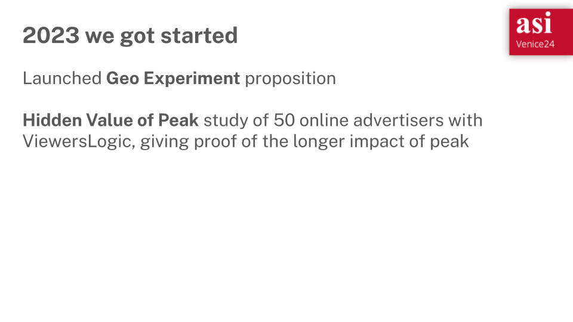

Which is why, last year, I shared that we’d been trying to measure outcomes for TV, by working on modern, 21st Century Regional Tests. Properly designed experiments with synthetic counterfactuals.

We had also did a piece with Viewers Logic where we proved that peak spots are the Duracell bunny of response advertising.

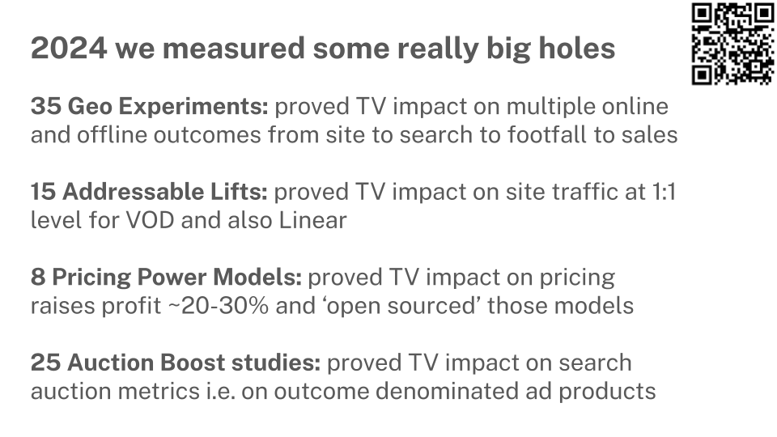

And since then we’ve been busy. All of these are linked in the QR code by the way, so if you want to learn more about any of them, feel free to take a picture.

Since last year we’ve run 35 of those geo experiments and built a whole set of outcome measurement propositions from simple Addressable Site Lift through to more advanced things like Auction Boost which looks at TV's effect on search auction pricing and Pricing Power which measures the impact of TV on price elasticity. 

And all of these have shown that TV makes the biggest holes around, but as any physicist will tell you, detecting black holes is hard work. 

Because you can’t see them directly, detecting black holes is hard work

And I have to admit that the past year or two has also been hard work. It’s been hard getting outcome data from advertisers. Hard building an experimental database. Hard proving medium-term effects in a scalable way. And when I met colleagues at Sky and Channel 4 doing outcome measurement work we found we were all feeling the same.

Now there’s a saying. If you want to go fast, go alone. If you want to go far, go together. So we started to ask ourselves: how far could we go together?  

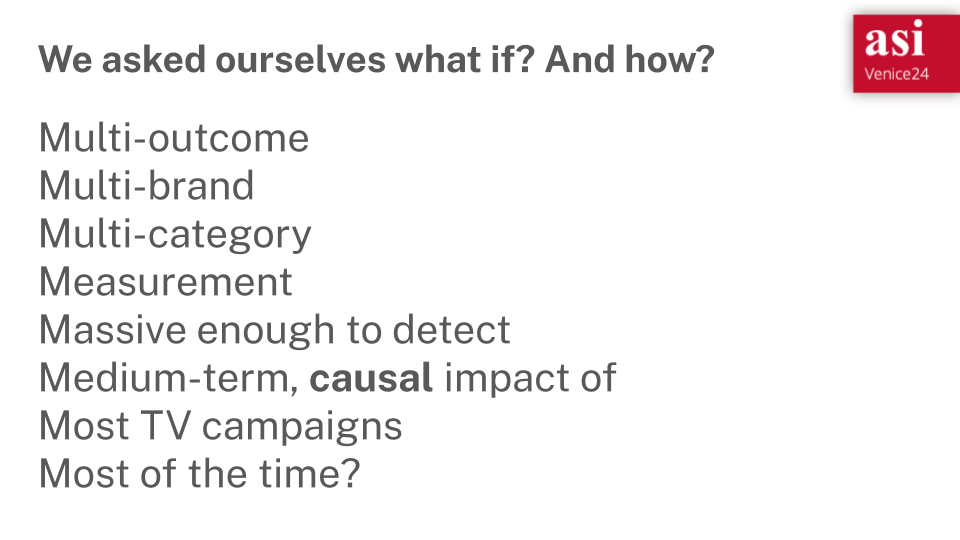

We asked ourselves, what if, rather than scratching out a living one study at a time, there was a way to make a Multi-outcome, Multi-advertiser, Multi-category Measurement system, Massive enough to detect the Medium-term, causal effects of Most TV campaigns, Most of the time? Not MMM but Mmmmmm

And like those physicists who figure out you can detect interstellar events with a swimming pool and a laser we realised we just needed two things we already have. 

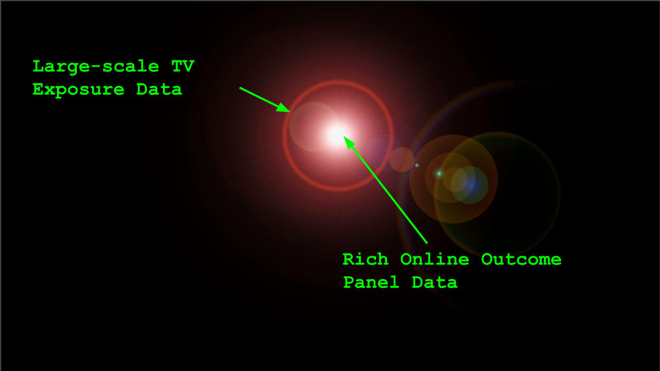

We’ve talked a lot about them already.

The first is large-scale TV exposure data. RPD. Server data, Whatever you want to call it, the fact is that today’s TVs have brains. They know the ads they played. There are billions of them out there and they’ve backed up their memories to the cloud.

The second is rich outcome data from online behavioural panels - metered or meterless - the websites we visit, the searches we do, the places we go. 

To illuminate the variety of online business outcomes created by TV advertising, all you have to do is link them. 

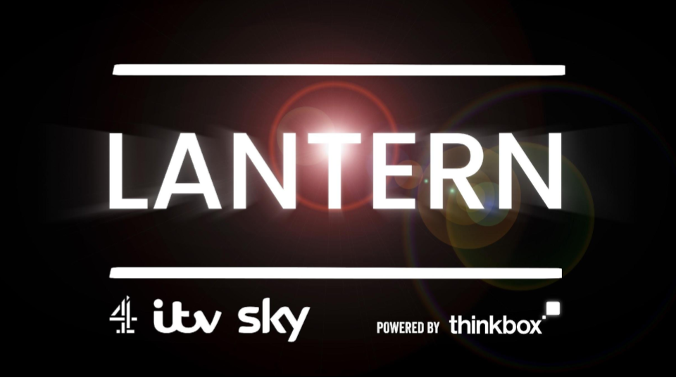

Which brings us to Lantern. A collaboration between C4, Sky and ITV, under the auspices of Thinkbox, to link rich, multi-outcome, multi-category behavioural data with large-scale TV exposure data to measure impact on outcomes. That’s it. Simple really. 

But it’s important to be clear about what we’re doing and when.

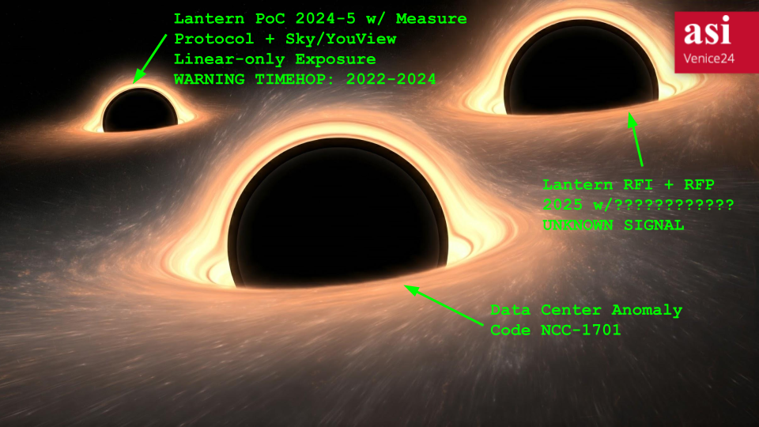

The plan is that we start with a small PoC. 

For the PoC only, we are working with Measure Protocol, and because they focus on  historical account level data they can go back in time to get up to 2 years of historical data for a panellist even if that panellist joins them today.

And of course the Sky and YouView data set go back in time as well, so by asking panellists what their subscriber ID is and getting permission to share if with the broadcaster, we’ll be able to get a cube of 2 years online behaviour with linear exposures.

We will learn lots about historical campaigns from that, but it is also already teaching us a lot about how to approach it technically, legally and commercially. One of the key things we will learn, through the magic of Bayesian statistics, is how big and how representative a panel would need to be to measure most campaigns.

Assuming that all checks out, we will do an RFI and RFP next year to build a production system. And that’s where you come in. Because it will take a lot of creativity and thought to figure that out. 

And after that, who knows? In one of my weirder fantasies I dream Sky has been taken over by Wayne Butler, Jeff Eales and Matt Hill (congrats btw).  They have got their hands on the access codes to Sky’s data centres, and have broken in to link Sky broadband and mobile data to its TV data to make a four million strong outcome measurement panel. 

Like I said. My dreams are a bit odd. 

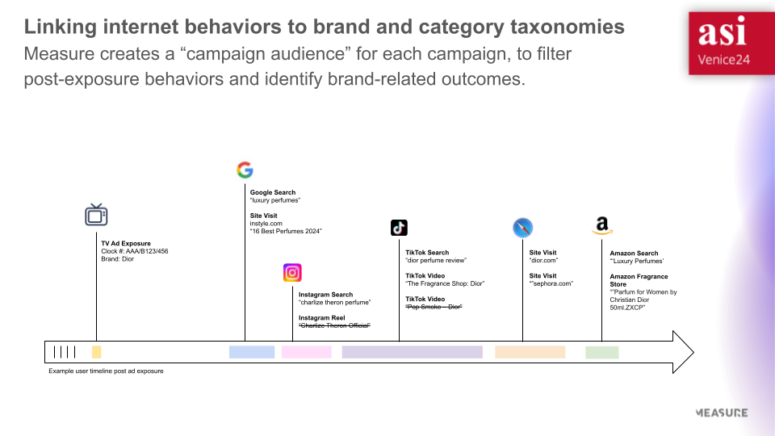

So what does this multi-outcome panel give us? Can’t show you data, because that’s within the team for now, but I can show you this marketing slide from Measure Protocol which will give you an idea of what it might look like. 

On the left we have an exposure of a Dior ad that happened on a panellists’s TV, which in our PoC might have been pulled in from Sky, YouView or similar. Following that,we have a number of different online behaviours, which happened afterwards, on a range of different devices. 

You can see that all those individual behaviours have been linked together by the system, by filtering out, for example, Charlize Theron Official. She was in the ad but that channel isn’t relevant here.

Now imagine having millions of events like this. And if you had a healthy sample of all perfume journeys. And you had perfume journeys for people who didn’t see that ad, but were otherwise similar in their behaviour. 

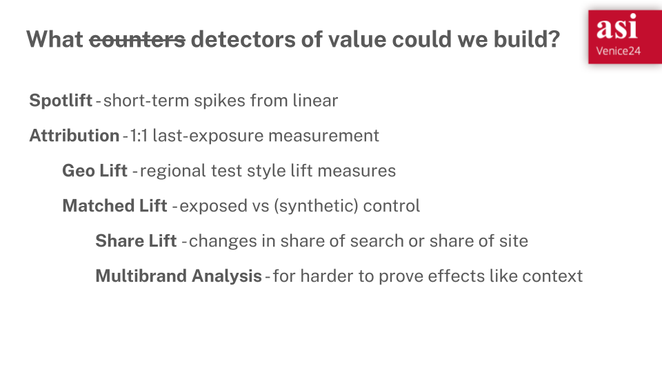

What detectors could we build? Because there’s a whole range of metrics you might imagine creating. 

There’s short-term spot lift from linear spikes, and attribution style measures - 10% of people who saw the ad went on to visit a shop selling Dior.

But then you could look at a geo lift or a lift versus a synthetic control. 

We could even look at share of search or share of site visits. 

And best of all, because the panel is stable over time you can look at medium-term effects, not just the short-term lift. And in this way it starts to light up the total value TV ads create for advertisers.

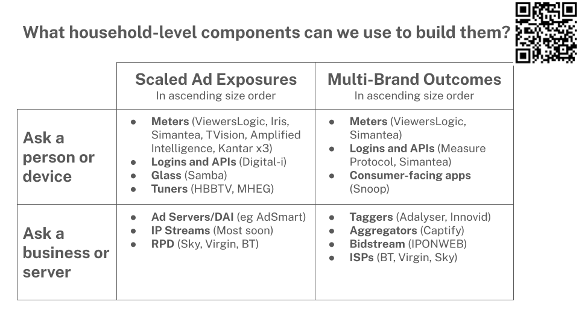

So here’s a framework you might find useful, that I hope distills some of what you’ve been hearing this week. And again, a QR code so can ask questions or find out more. 

There are scaled sources of ad exposures and there are sources of outcomes for multiple brands

And there are two ways you can get those things. You can get them from people and their devices. Or you can go to a business that has them stored somewhere. 

So putting that together you get a pretty decent map of what matters in the UK for outcome measurement. In the left hand column we have both the chickens and the eggs they have laid. And you heard a lot yesterday about how to combine those. You can see the 8 UK panels (yes Richard I think I’ve found two more) as well as a bunch of other ways to get viewing out 

And on the right hand side you have a range of businesses who collect a spectrum of outcome data, particularly for online outcomes. You might be less used to thinking about those and there’s a wide range. Everything from apps that offer people a useful service like financial management, in return for access to their bank statements. To panels that have meterless collection. 

Three things to do when you get back to your desk on Monday

