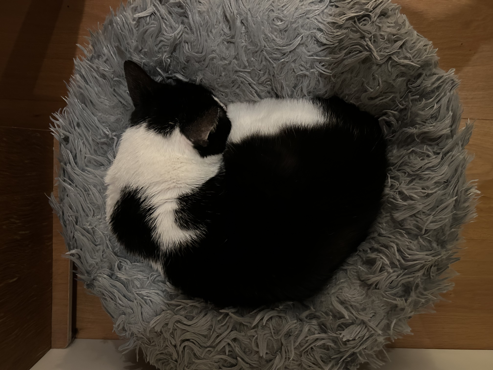

> _This doesn't work yet, but it will_

# Slide 1
---

# Slide 2
---

# Hello there

This presentation will show you examples of what you can do with Quarto and Reveal

- Bullets
- Images
- Videos
...and much more

---

# Hash means new slide
- and more bullets
- appear like this

---

## Smaller title has two hashes
And you can add images
{#fig-cat}

---

# You can do builds
::: {.incremental}
- Which look a bit weird in the text
- Eat spaghetti
- Drink wine
:::

---

# You can present with notes
You just need to use that weird syntax again

::: {.notes}
Speaker notes go here. This uses the colon syntax and means they appear in the body of the text for longhand document but in speaker notes when presented as a slideshow. 
:::

---

# Or if you want to get clever
You can tell it to put your notes in the PDF, but hide them when presenting as a slideshow.

<aside class="notes">
Shhh, these are your private notes using the aside class. The syntax is clunky but it means that this text will go in speaker notes for slideshow and in the right hand side for document.
</aside>

---