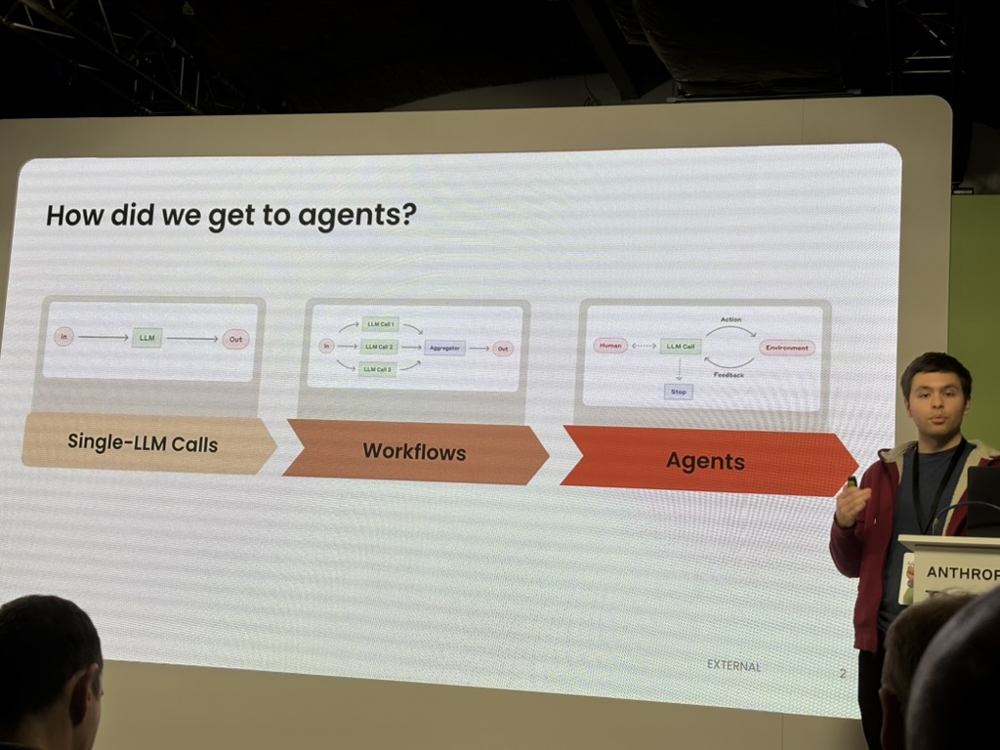
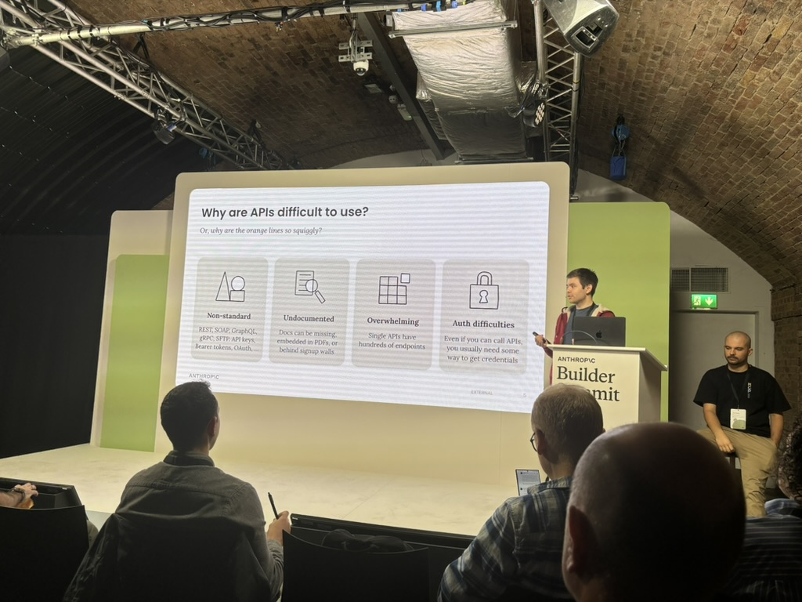
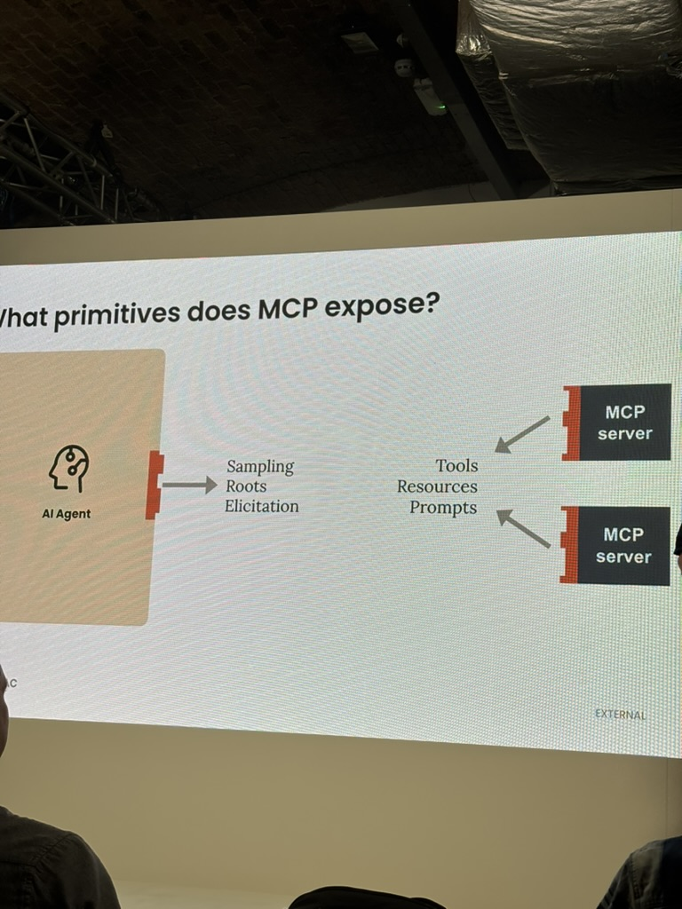
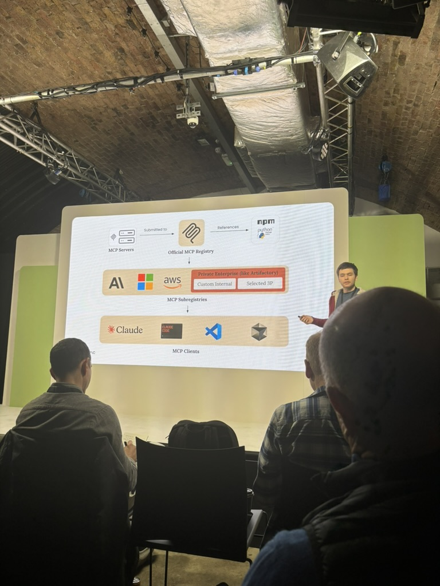
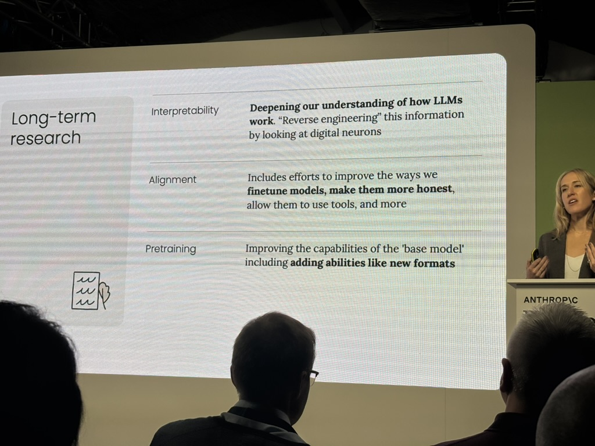

> **TL;DR**: Specs are the new code. Evals are the new moat. Tool-provision is the new prompt engineering. (Just less catchy.)

Fascinating afternoon at Anthropic's Builder Summit in London seeing the future of work being figured out in front of me.

First, the big picture: there's lots of headroom still. No sign that smaller models are catching up to larger ones, so talk of an AI plateau is premature. The frontier keeps moving.

But more important for day-to-day work: some clear patterns are emerging about how we should actually _use_ these things. And it all comes back to one scarce resource.

## Context is (still) the bottleneck

Here's the key insight: even with massive context windows, context is still _scarce_. Not in absolute terms, but relative to what you're trying to accomplish.

One of Anthropic's researchers framed it beautifully: there's what's 'in the weights' (baked into the model through training) versus what's 'in context' (fed in each time). Even with huge context windows, every token has to earn its keep. It's all about return-per-token.

Giving an AI model access to tools is like teaching someone to use a calculator instead of explaining multiplication tables every single time. The tool definition takes up some context, but it pays for itself many times over.

Anthropic is doubling down on this with two new features in beta:

- **Memory**: The model can leave notes for itself between sessions, Memento-style. So you don't keep explaining the same things.
- **Context Editing**: Automatically prunes verbose output from tool runs, keeping only what matters.

The upshot? Building good tools — perhaps bespoke to your specific task — becomes critical. Tool-making is the new prompt engineering. (Though that's not quite as catchy.)

## The great inversion: specs are forever, code is disposable

The CTO of Tessl made a striking observation: we've inverted the relationship between specifications and code. Specs used to be throwaway documents that got outdated the moment you finished writing them. Code was what lasted.

Now? The spec _is_ the code. Or at least, it's what matters.

If you're a programmer, this is the revenge of Test Driven Development. If you're a sociologist, it's functional explanations winning out. Software is what software does, not the lines of code that make it happen.

## Humans are more than their workflows

The brilliant Shahriar from Metaview talked about the difference between deterministic workflows and looping agents. We've heard this before: do you hard-code the steps or let the AI figure it out?

His rug-pull: _For human jobs, tasks are only deterministic in small time windows_. The world keeps changing, requirements shift, edge cases emerge. So you can't really build deterministic systems for anything that matters. It's agents and adaptation all the way down.

This might change what a competitive moat looks like in software. Base models will presumably keep getting better — that seems like a safe bet. But if you can judge 'good' for your specific domain brilliantly, balancing different stakeholders' views of quality, then that effort should protect you. In theory, anyway.

As Shahriar put it: "The moat is evals." Knowing what good looks like, and being able to measure it reliably, becomes your defensible advantage.

## Why MCP actually matters

I've been skeptical about MCP (Model Context Protocol). We already have APIs. We've spent decades building them. Why add another layer? But hearing from one of the three co-originators was revealing. And once again, it's the context, stupid. (Stupid being me in this case.)

The problem with APIs—from an AI's perspective:

1. **Variable**: REST, SOAP, GraphQL, gRPC, bearer tokens, OAuth... every API speaks a different dialect
2. **Poorly documented**: Missing docs, PDFs, signup walls—or spread across a hundred wiki pages
3. **Overwhelming**: A single API can have hundreds of endpoints, most of which you'll never need
4. **Auth is hard**: Even when you can call an API, you need credentials, and managing those is its own nightmare

All of which means APIs burn through context without delivering enough value in return. You spend tokens explaining the API structure instead of solving the actual problem.

**MCP's job is abstraction.** It sits between servers (your internal tools, selected third-party services, enterprise systems) and clients (Claude Desktop, VS Code, your custom apps).

MCP exposes six core primitives, split into two groups. **Server-side primitives** (what servers provide): Tools, Resources, and Prompts. **Client-side primitives** (what clients provide back): Sampling (allows servers to request LLM completions without bundling their own model), Elicitation (allows servers to request user input or confirmation), and Logging.

Think of it as a universal adapter: standardizing how AI models access functionality while keeping the interface lean enough to be context-efficient.

After a slow start, Anthropic is moving toward an official MCP registry. I don't envy whoever has to run that thing — the moderation headaches alone — but it'll be valuable to have a canonical place to find well-built MCPs.

The vision is that over time it becomes normal for software systems to ship with official MCPs alongside their APIs — written by the system owners themselves. Right now there are dozens of community-built Google Workspace MCP servers, but I wouldn't trust any of them (data exfiltration concerns). The alternative is to get Claude to write one for me, but that won't necessarily be optimized for the most useful tools.

And here's where it gets interesting: through the Sampling primitive, MCP servers can ask Claude to invoke _other_ tools available in the session. Which means you can build higher-level MCPs that orchestrate lower-level ones. Tools that use tools. "Claudeception," as someone on stage called it, to nervous laughter.

The combinatorial explosion this enables is significant.

## Don't panic—and other practical advice

If all this talk of building custom tools and MCPs sounds daunting: relax. You can get Claude to build them for you.

Be clear about what problem you're solving, feed it the API docs and your spec, and let it generate the MCP. Then iterate. The tooling for building tools has never been better.

But context-consciousness goes beyond formal tools. It's also about the environment the model works in and how you steer it. Small example: Rust is apparently good for Claude because it compiles quickly. An engineer speculated that functional languages might work better too, thanks to their limited state. The less context you spend managing complexity, the more you have for actual work.

## Work at the edge of what's possible

The biggest learning for me: you have to keep pushing these models to bite off as much as they can chew. Slightly more, even. The best way to use them is at the boundary of their abilities. Which means working at the boundary of yours.

Case in point: Computer Use (Claude controlling a mouse and keyboard) was tried _three times_ before it worked. There was some caginess about what finally unlocked it—vision integration, most likely—but in the meantime they tried DOM manipulation and other approaches. They kept pushing. Eventually something clicked.

## Where this is all heading

Amanda Donohoe from Anthropic laid out the long-term vision: contextual intelligence, long-running execution, genuine collaboration. A model that learns about context, can keep going for hours and genuinely feels like a collaborator.

The dream is that the 100th task the agent does for you should be _better_ than the first. Not just faster — better. The agent should understand the what and the why behind your work, learning your preferences and your organization's patterns so you're not constantly re-explaining.

That requires both episodic memory (what happened last time) and organizational memory (how we do things here). Which brings us back, again, to context efficiency.

She outlined three strands of long-term research, and they all point the same direction:

**1. Pretraining** — Improving the base model itself, baking in new capabilities like vision or multimodal understanding. Get more into the weights, free up context. Vision was the unlock for Computer Use. What's next? Audio? Video? Spatial reasoning?

**2. Alignment** — Fine-tuning models to be more honest, more reliable, better at using tools. Making models more context-efficient by letting tools handle complexity instead of explaining everything in natural language.

**3. Interpretability** — Reverse-engineering how LLMs work by examining the "digital neurons" inside them. The better they understand how tools and models interact, the more efficient they can make that interaction.

## The through-line

Everything—Memory, Context Editing, MCP, the long-term research agenda—points toward the same goal: getting more done with less context burn.

Which means the work you're putting into building tools, writing specs, and developing evals isn't throwaway effort. It's not just for this generation of models.

It's the shape of the work going forward.

If the conference speakers are right, specs are the new code. Evals are the new moat. Tool-building is the new prompt engineering.

And context? Context is the new scarce resource we're all learning to manage.

Welcome to the new job.
