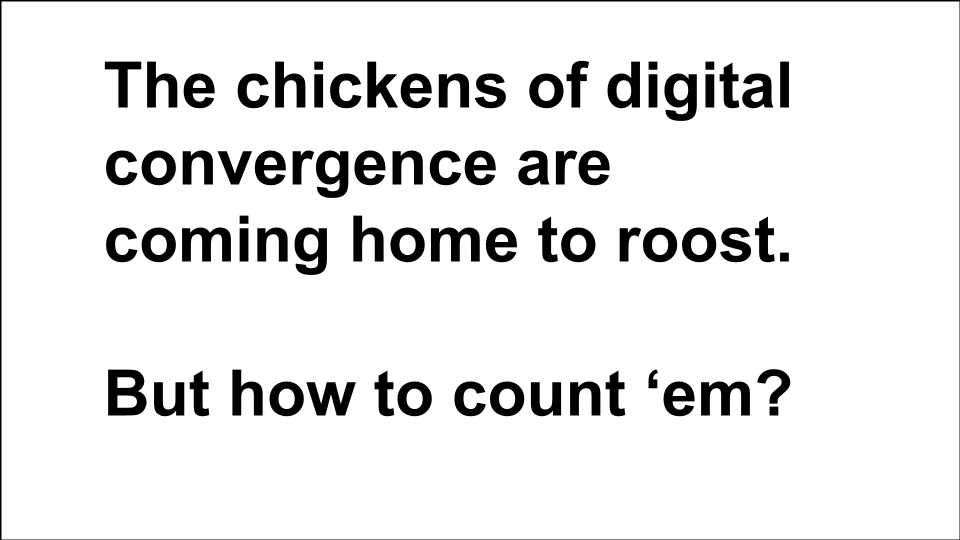
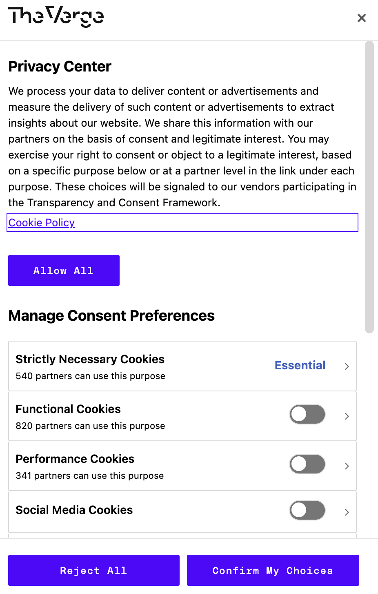
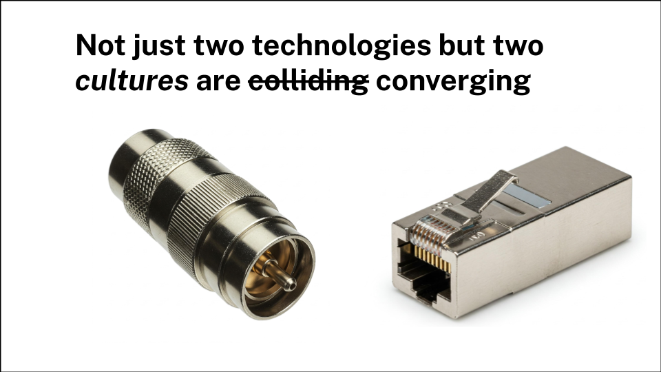
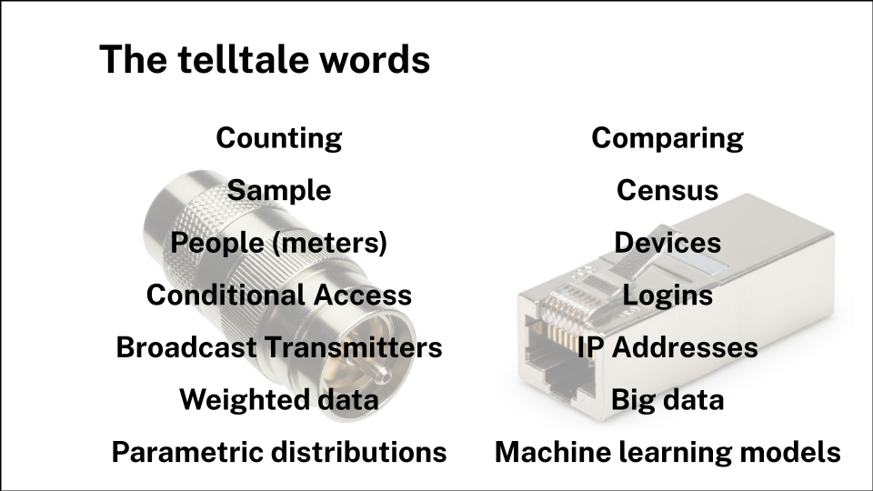
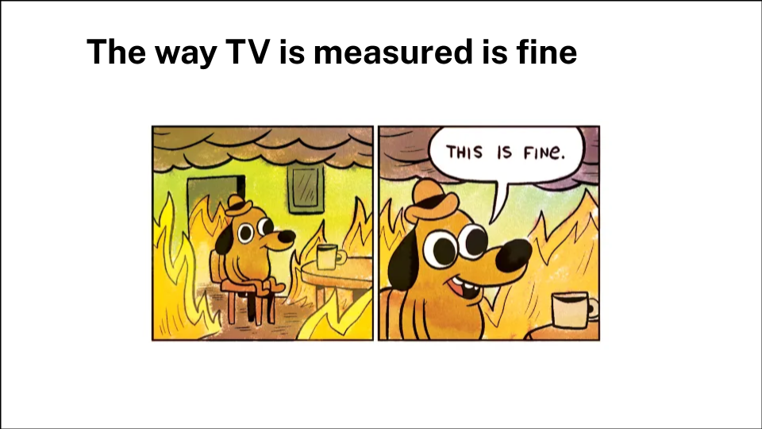

> I was asked to present at an invite-only breakfast, hosted by VideoWeek, to introduce the brilliant Sebastian Hinterstoisser from TV Insight. So naturally enough I ended up talking about the Chickens of Convergence.

Good morning. I’m Sameer Modha and I look after the Outcome Measurement Innovation team at ITV. I was lucky enough to get a sneak peek yesterday, of what you’re about to hear from Sebastian, and I think it’s fascinating. 

So before you hear from him, I want to try and put what he and his colleagues in Austria have achieved into a recent historical context. I want to explain *why* I think it is fascinating and what it hints at about the next few years of digital convergence.

# From Spy Radios to Smart TVs

Let's start with a question though. Has anyone here heard of Numbers Stations?

For the uninitiated, they were a classic piece of one-way spycraft. A spy, somewhere deep in enemy territory, could tune into a shortwave radio frequency at a specific time and listen to a disembodied voice reading out strings of numbers. It was the perfect one-way communication: you could receive your instructions without ever revealing who (or where) you were.

You can hear an example here. 



For decades, broadcast TV worked in much the same way. It was a numbers station for the masses; you could watch all you wanted, and nobody would know. Except for the handful of households with people meters in their home - a random sample from which to estimate what the population at large was doing. 

That world is gone. In the digital realm, you announce your presence constantly. It's unremarkable to log in to Netflix, and we've all become begrudgingly accustomed to accepting the attentions of the hundreds of "partners" who are apparently essential to the functioning of The Last Website on Earth™.

# The Two Tribes: Coax vs. IP

But what we're seeing isn't just a convergence of two technologies – the coaxial cable and the Ethernet plug if you like – but a collision of two completely different cultures.

You can tell which culture you're dealing with by the words they use.

On one side, you have the world of Team Coax. They talk about **samples**, **people meters**, and **weighted data**. They worry about statistical distributions and, above all, they are in the business of measuring **reach**. It's a culture of counting.

On the other side is the world of IP. It speaks of a **census** of **devices**, using **logins** and **IP addresses** to process **big data**. It's a culture built not on counting, but on *comparing* one group to another to measure **outcomes**.

# The Old Way: Measure, Transact, Model, Repeat

For a long time, the old way was fine. The media owner paid for the system that measured reach; the buyer and seller transacted on that reach; and the advertiser paid an analyst to model the link between that reach and its business impact.

It was a neat little loop: Measure, Transact, Model, Repeat.

Eat, Sleep, Rave, Repeat for the media world.

And you probably think that that old way is fine. But it probably isn't. I'll give you an example. A funny thing happens at the debrief for a Market Mix Model (MMM). The econometrician shows a chart and says the ROI for a campaign was 0.7. The client, quite reasonably, asks, "Doesn't that mean I lost money?". "Ah," says the modeller, "don't worry. We just multiply it by three to account for the long-term effects".

I'm not making this up; it's common practice to multiply our way past the short term to justify long-term investment. But as Keynes famously said, in the long run, we're all dead.

# How the Platforms Changed the Game

Into this world of long-run justifications came the digital platforms. And they came with a killer proposition: in return for an advertiser handing over their outcome data, the platforms would take on the job of measuring the business impact themselves.

Advertisers were so delighted that they shovelled more and more of their outcome data — their sales, their leads, their sign-ups - into the platforms. The platforms, in turn, got scarily good at predicting, and even optimising for, those outcomes, because they had lots of them. It's the tragedy of machine learning - your data is worthless to you but valuabe to someone else, when combined with everyone else's.

*Image: A table with four columns: Media Outputs, Brand Outcomes, Intermediate Outcomes, and Business Outcomes. It shows a progression from "Cost Per Eyeball" to "Cost Per Sale / Profit / LTV".*

It's gone so far that the platforms can now sell incrementality. They can promise to spend an advertiser's money on *just* the people who wouldn't have bought otherwise, avoiding the two cardinal sins of marketing waste: spending money on people who will never buy, and spending it on people who were going to buy anyway.

*Image: A screenshot of a LinkedIn post by analyst Eric Seufert discussing Meta's shift to incrementality optimization.*

### **Outcomes Won. Eyeballs Lost.**

Is it any wonder, then, that outcomes won? Looking at UK ad spend, we reckon that outcome-based buying overtook eyeball-based buying across all media back in 2019.

*Image: A bar chart showing the % of media spend by "Audiences" vs. "Outcomes" from 2014-2022, with a pink arrow highlighting the crossover point in 2019.*

And if you were thinking video advertising was immune, I have bad news. For video, the tipping point probably happened around 2023.

*Image: A similar bar chart for video ad spend, with a pink arrow highlighting the crossover point around 2022.*

But here’s a question. They may take over half the money, but is over half of the value that advertising creates actually caused by those platform ads? Broadly speaking, no. The current measurement approach massively undervalues TV.

### **So What Do We Do?**

And how have we responded to that challenge? Strangely, the brand marketing world’s response has been one of denial. We’ve had "The Long and the Short of It," told advertisers off for using "toxic digital metrics." We've pushed the "60/40" rule to try and keep them spending 'correctly'.

But telling advertisers they are wrong is rarely a persuasive strategy. So, rather than fight it, why not meet them where they are? Why not measure the powerful, medium-term business impact of TV on the same terms the platforms use?

*Image: A collage showing a WARC article by Peter Field, the cover of "The Long and the Short of It" report, and its 60:40 split chart.*

This is our mission: to give TV the outcome measurement it deserves. We need to measure the breadth of business outcomes delivered by TV, and do it now, not "jam tomorrow".

*Image: A strategy slide with the mission "Give telly the outcome measurement it deserves" and strategies including "Measure outcomes of TV campaigns at scale".*

### **Enter Lantern**

This is where projects like **Lantern** come in—a cross-broadcaster initiative to link large-scale TV exposure data with a rich panel of online outcome data.

*Image: The "LANTERN" project logo with Channel 4, ITV, Sky, and Thinkbox logos below it.*

*Image: A conceptual diagram with a lens flare effect, showing arrows for "Large Scale TV Exposure Data" and "Rich Online Panel Outcome Data" converging on a central point.*

You might wonder what this has to do with audience measurement.

### **The Same Well, Two Different Thirsts**

It's because audience and outcome measurement draw from the same well.

For audience measurement, the goal is to sell the water. The focus is on counting reliably. We worry about sample bias, we reweight the data, and we are careful not to accept anyone onto our panels who actually wants to be there. Counting the eyeballs is an end in itself.

*Image: A photo of a wooden bucket being drawn from a traditional stone well.*

But for outcome measurement, you don't want to aggregate that data straight away. You want to keep it at an individual level until you can join it to an outcome, like a website visit or a purchase. The goal isn't to count, but to *compare*.

In this world, as long as your exposed and control groups are comparable, many of the biases simply drop out — in perhaps the same way that the alcohol in beer brewing kills off anything unpleasant in the water.

*Image: A photo of a freshly poured glass of beer sitting next to a small burlap sack of barley and a few loose hops.*

So how do we get water for both?

*Image: The photo of the coaxial and Ethernet connectors, side-by-side.*

### **The Chickens Finally Come Home to Roost**

In Europe, TV operating systems like HbbTV and MHEG-5 have been speaking both Coax and IP for years. In Austria, the new AGTT Teletest system uses HbbTV to collect viewing data from millions of TVs, building a panel that is calibrated against the traditional people meter but reports in real-time. It’s the result of a productive conversation between Team Coax and Team IP.

*Image: Logos for HbbTV and the MHEG-5 standard.*

*Image: A photo of a presentation slide from the Austrian AGTT showing a TV screen with a data privacy message in German.*

Here in the UK, if you buy a new Freely TV and plug it in, you’ll have a moment of cognitive dissonance. The part of your brain that thinks like a spy expects to just tune in to ITV1. Instead, you're politely asked to sign in to ITVX first, just to watch linear TV.

It’s like a spy's radio asking for a login before it will tune to the numbers station. The chickens of convergence are well and truly coming home to roost. The challenge now is to work out the best way to count them.

*Image: A screenshot of the Freely TV user interface, showing an ITV1 broadcast and a prominent yellow button prompt to "sign in" to ITVX.*

