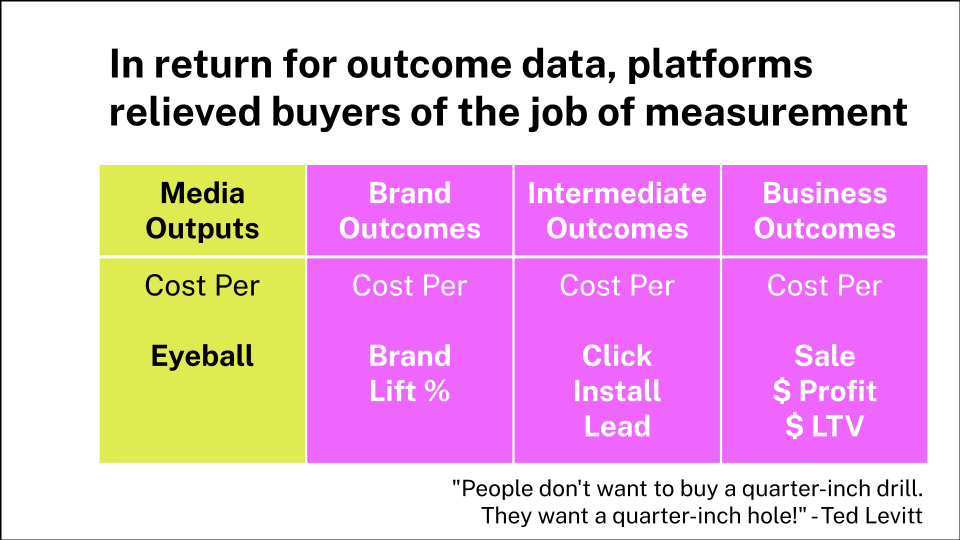
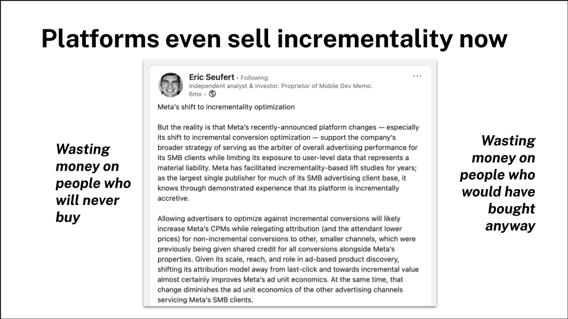
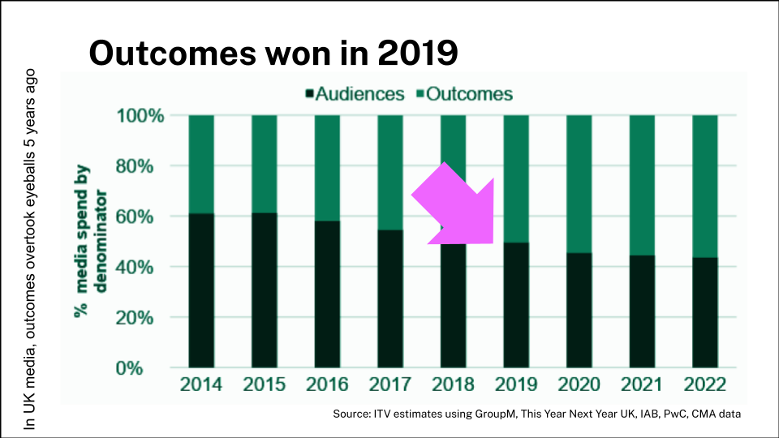
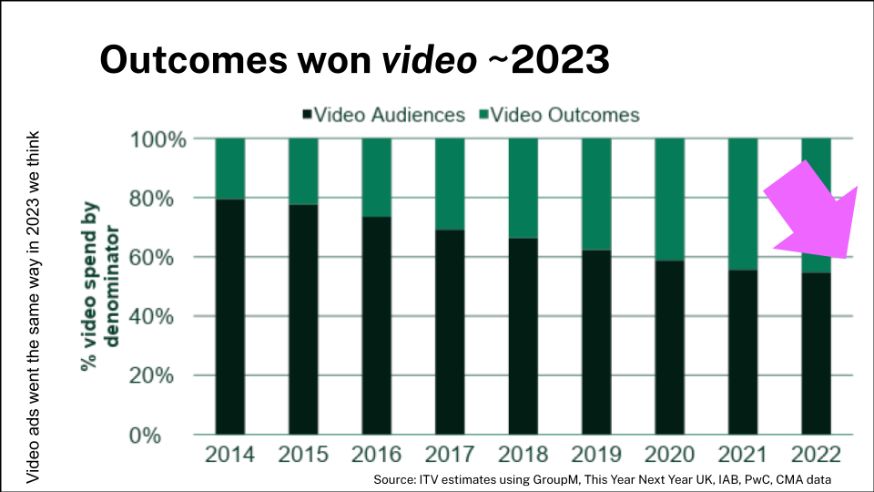
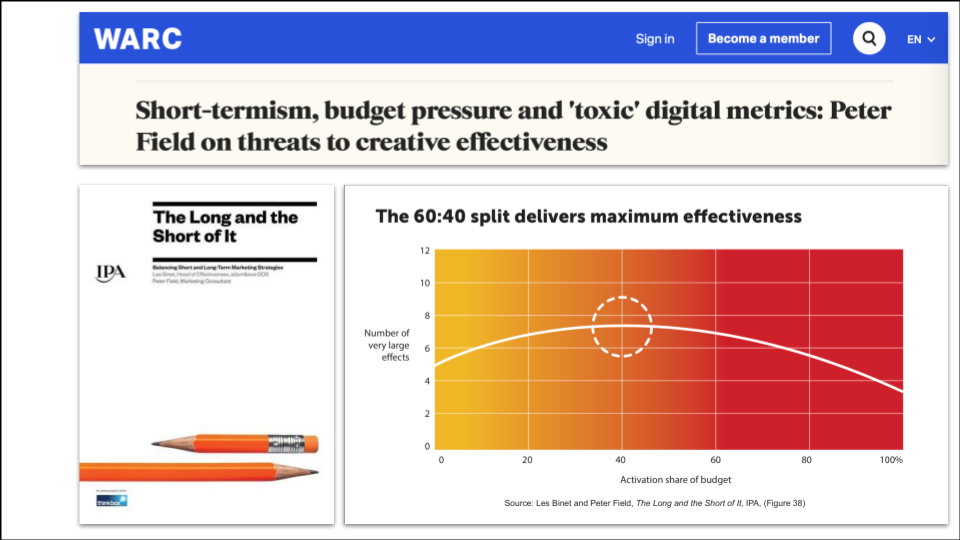
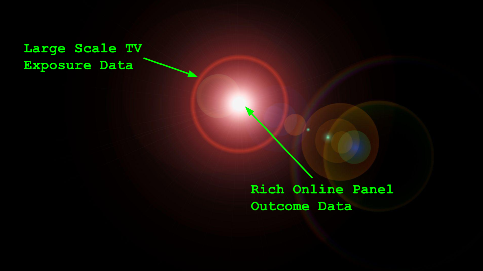
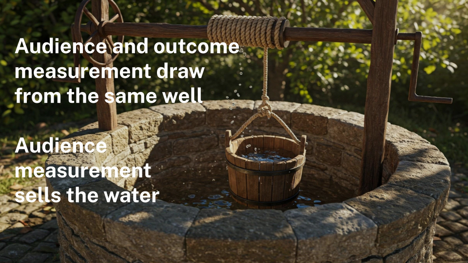

> _Back in February I was delighted to be asked to present at an invite-only breakfast, hosted by VideoWeek, to introduce the brilliant Sebastian Hinterstoisser from TV Insight. So naturally enough I ended up talking about The Chickens of Convergence._

> _Enough time has passed that I think it's OK to put up a version of the talk I did. Since then I've only become more convinced that having mastery of large scale linear impression data is critical for the future of broadcasters. Historically we've been content with collecting small samples through TAM panels, but now we need all of it - or as near as dammit. And if that can be aligned to the way we do audience measurement, that leads to some pretty great possibilities._

Good morning. I’m Sameer Modha and I look after the Outcome Measurement Innovation team at ITV. I was lucky enough to get a sneak peek yesterday, of what you’re about to hear from Sebastian, and I think it’s fascinating so I'll do my best not to keep you too long before the main event. 

But before you hear from him, I want to try and put what he and his colleagues in Austria have achieved into a recent historical context. I want to explain *why* I think it is fascinating and what it hints at about the next few years of digital convergence, and TV measurement. 

# From Spy Radios to Smart TVs

Let's start with a question though. Has anyone here heard of Numbers Stations?

For the uninitiated, they were (and still are) a classic piece of tradecraft. A spy, somewhere deep in enemy territory, could tune into a shortwave radio frequency at a specific time and listen to a disembodied voice reading out strings of numbers. It was the perfect one-way communication: you could receive your instructions without ever revealing who (or where) you were.

You can hear an example here. 



For decades, broadcast TV worked in much the same way. It was a numbers station for the masses; you could watch all you wanted, and nobody would ever know... except for the companies doing audience measurement. They had a small handful of households with people meters in their home - a random sample of people whose behaviours they could observe, and from whom they were able to estimate what the population at large was doing, *as long as they were all doing the same thing.*

For better and worse, that world is going. In the digital realm, we announce our presence constantly. It's utterly unremarkable that you need to log in to Netflix to watch it, and we've all become accustomed to accepting the attentions of the hundreds of "partners" who are apparently essential to the functioning of The Last Website on Earth™.

And the technologies that did this on the small screen have spread to the big one. When I bought a TV from Amazon recently, I had to login to it. So that whole digital convergence thing that we used to talk about with such excitement? It finally happened. 

# The Two Tribes: Coax vs. IP

And I think the important thing about this is not the convergence of two technologies – the coaxial cable and the Ethernet plug if you like – one carrying broadcast signals, the other carrying two way internet communication - but a collision of two completely different cultures. The culture of audience measurement and the culture of outcome detection. 

You can tell which one you're dealing with by the words they use.

On one hand, you have the world of Team Coax. They talk about **samples**, **people meters**, and **weighted data**. They worry about statistical distributions and, above all, they are in the business of measuring **reach**. It's a culture of counting.

On the other side is the world of IP. It speaks of a **census** of **devices**, using **logins** and **IP addresses** to process **big data**. It's a culture built not on counting, but on *comparing* one group to another to measure the lift in **outcomes**.

This is very different from how it used to be. 

# The Old Way: Measure, Transact, Model, Repeat

For a long time, the old way was fine. The media owner paid for the system that measured reach; the buyer and seller transacted on that reach; and the advertiser paid an analyst to model the link between that reach and its business impact.

It was a neat little loop: Measure, Transact, Model, Repeat. Not as fun as Mr Slim's sadly. 

And you may be thinking that that old way is still fine. But it isn't. I'll give you an example. A funny thing happens at the debrief for a Market Mix Model (MMM). The econometrician shows a chart and says the ROI for a campaign was 0.7. The client, quite reasonably, asks, "Doesn't that mean I lost money?". "Ah," says the modeller, "don't worry. We just multiply it by three to account for the long-term effects".

I'm not making this up; it's common practice in some measurement circles to multiply our way past the short term to justify long-term investment. It's often done in a mathematically fancier way than this, and there are lots of good reasons to do the things practitioners do. But as Keynes famously said, in the long run, we're all dead.

# How the Platforms Changed the Game

Into this world of long-run justifications came the digital platforms. And they came with a killer proposition: in return for an advertiser handing over outcome data, the platforms would take on the job of measuring the business impact, releiving advertisers of the burden of doing so themselves. 

Advertisers were so delighted that they transmitted more and more of their outcome data - their sales, their leads, their sign-ups - into the platforms. The platforms, in turn, got scarily good at predicting, and even optimising for, those outcomes, because they had lots of data on each one. It's the tragedy of machine learning - your data can be worthless to you but valuabe to someone else.

It's gone so far now that the platforms can sell incrementality. They can promise to spend an advertiser's money on *just* the people who wouldn't otherwise have bought, avoiding both cardinal sins of marketing waste: spending money on people who will never buy, and spending it on people who were going to buy anyway.

# Outcomes Won. Eyeballs Nil.

Is it any wonder, then, that outcomes have won? Looking at UK ad spend, we reckon that outcome-based buying overtook eyeball-based buying across all media back in 2019.

And if you were thinking video advertising was immune, I have bad news. For video, the tipping point happened later - probably around 2023, but still a couple of years ago.

But here’s a question. They may take over half the money, and they obviously have effective ad products, but is over half of the value that advertising creates actually created by those platform ads? Broadly speaking, no. For a bunch of reasons this new measurement paradigm massively undervalued TV. So how did we respond as an industry?

# So What Did We Do?

Strangely, brand marketing's response for years was one of denial. We reminded advertisers about "The Long and the Short of It". We told them off for using "toxic digital metrics." We pushed the "60/40" rule to try and keep them spending 'correctly'.

But telling someone they are wrong - advertisers or other people - is rarely a persuasive strategy. Rather than fight it, why not meet them where they are? Why not measure the powerful, medium-term business impact of TV on the same terms the platforms use?

This is our mission: to give TV the outcome measurement it deserves. We need to measure the breadth of business outcomes delivered by TV, and do it for the near-term, rather than endlessly promising "jam tomorrow".

# Enter The Lantern

This is where projects like **Lantern** come in - a cross-broadcaster initiative to link large-scale TV exposure data with a rich panel of online outcome data.

The Lantern PoC that's being worked on at the moment combines large scale linear ad exposure with large scale behavioural outcome data. Meaning we can link the ads people see, to the things they do, not just five minutes after the ad, but days and weeks after. "But what's that got to do with audience measurement" I hear you ask. Well.

It's because they both draw water from the same well. (Sorry.)

# Same Well, Different Thirsts

For audience measurement, the goal is to sell the water. The focus is on counting reliably. We worry about sample bias, we reweight the data, and we are careful not to accept anyone onto our panels who actually wants to be there. Counting the eyeballs is an end (and an art) in itself.

But for outcome measurement, you don't want to aggregate that data straight away. You want to keep it at an individual level until you can join it to an outcome, like a website visit or a purchase. The goal isn't to count, but to *compare*.

By blending the water of exposures with the barley of outcome data and a sprinkling of permissions, you can make something altogether tastier, and, in fact, higher margin than water. That's right, you can sell people on the lift they get from beer. 

And in this world of lift measurement, as long as your exposed and control groups are comparable, many of the biases simply drop out - in perhaps the same way that the alcohol in beer brewing kills off anything unpleasant in the water. It doesn't matter so much if the data are not drawn from as clean a sample, because you're not just counting any more. 

So how do we get water for both?

# The Chickens Of Course...

In Europe, TV operating systems like HbbTV and MHEG-5 have been speaking both Coax and IP for years. And in recent times they've reached critical mass. Most TVs are now connected to both a coax cable and to the internet. 

So in Austria, the new AGTT Teletest system has been able to use HbbTV to collect viewing data from millions of TVs, building a panel that is calibrated against the traditional people meter but reports in real-time. It’s the best result I know of, of a productive, collaborative conversation between Team Coax and Team IP.

You'll hear more about that in just a second, but even here in the UK there are signs of change. If you buy a new Freely TV and plug it in, you’ll have a moment of cognitive dissonance. The part of your brain that thinks like a spy expects to just tune in to ITV1. Instead, you're politely asked to sign in to ITVX first. Just to watch linear TV.

Of course the reason is so that we can link all the viewing and exposure to a single place (and handle user privacy preferences better) but in essence it’s like a spy's radio asking for a login before it tunes to the numbers station. The chickens of convergence are well and truly coming home to roost. The challenge now is to work out the best way to count them and measure the amount of lift they can generate. 

