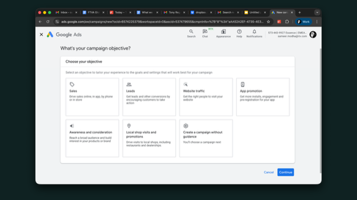
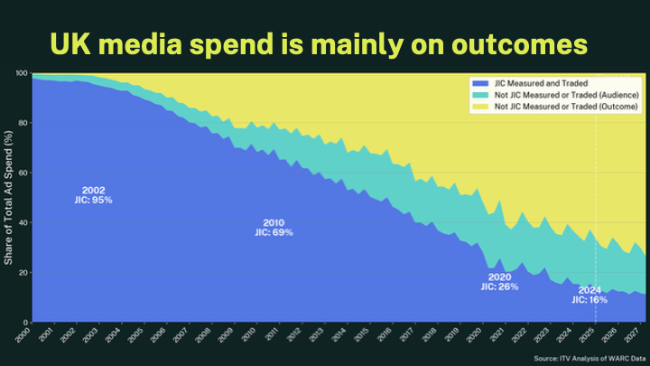
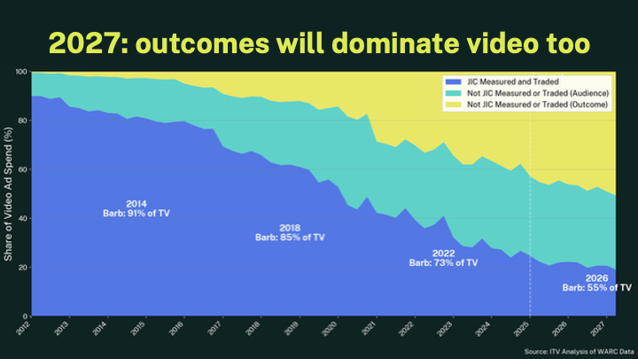
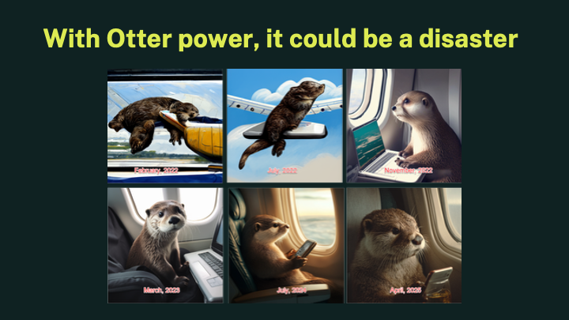
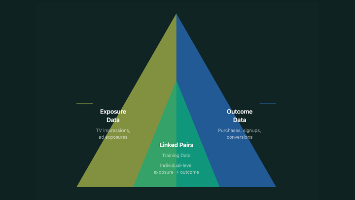
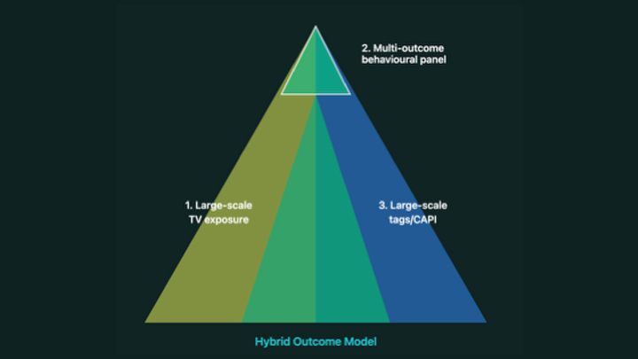
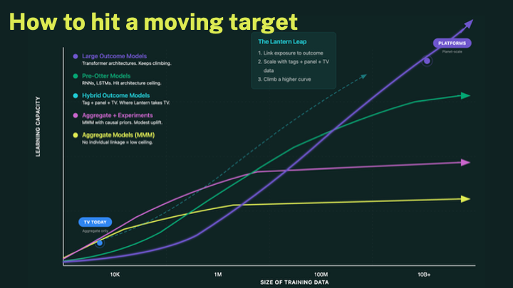
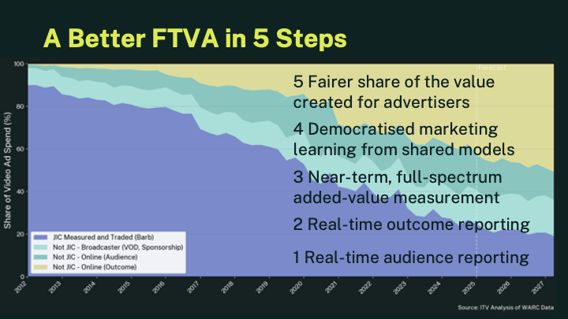

> This is an adapted version of my opening talk at the Future of TV Advertising Global conference in December 2025. The session was called "Next Steps in Outcomes" - and yes, I did promise to help the audience feel like Scrooge at the (end of) A Christmas Carol.

Here's the uncomfortable truth: television's share of ad spend is now less than the share of value it creates for advertisers. And things are about to get worse.

In the next few minutes, I want to explain three things:

1. Why we've ended up here
2. How Large Outcome Models are going to make it harder
3. What we need to do about it

## Google's Little Shop of Outcomes

Has anyone seen this before? Has anyone spent money on one of these buttons?

If you work in TV advertising and you haven't, you should really be ashamed. This is the shop where tens of billions of pounds are spent in Britain alone. About 2 trillion pounds has gone through interfaces like this in the past 10 years.

This is Google's little shop of Outcomes. Every year millions of people come here to think about what outcome they'd like to buy for their business. Do they want visitors? Do they want sales? Do they maybe want leads to their sales team?

And whether we like it or not, that shop has completely changed the industry.

## The Scale of the Shift

This chart shows the total media spend in the UK over the past 25 years, split by whether that medium has a Joint Industry Committee (JIC) or not.

It tells us something very clearly: advertisers - large and small alike - simply do not worry about measurement quality, independence, and transparency in the way the audience measurement community does.

But here's what really matters. When you add estimates of how much money goes into those outcome-buying boxes across Meta, Google and others, you see that the shift in money is not about buying one kind of audience versus another.

**It's a shift from buying audiences altogether.**

As Josh Lachkovic explained in his session, in most cases today, advertisers using these platforms don't even pick an audience. They just run with open targeting and let the outcome data drive what the audience should be. Their audience - if you can call it that - is a *result* of what they do, not a choice they make upfront.

## The Video Wake-Up Call

You might be thinking: "Yeah, but we're fine in video advertising."

No. We're not.

By 2027, outcome-bought video will have overtaken audience-bought video. These are ad buys where you spend money on showing a video ad to people, but you only pay when they do something.

And in the world of good old-fashioned TV spend? In two years time, according to WARC forecasts, the majority of TV spend won't be traded on BARB data.

## The Otters Are Coming

And if that sounds bad, just wait until the otters come.

Professor Ethan Mollick has a running test. Every time he plays with a new AI model, he asks it to make an image of "an otter on a plane using wifi." In the early days, the images were frankly disturbing. Look at how good they've gotten in a few short years.

OK you know all this. You didn't come to hear about how AI is cool.

But the thing you don't know is that there is currently a massive rebuilding effort under way. The glut of AI-generated creative is choking the 20-year-old models that power the platforms. There are too many ads for them to sift through.

So they're rebuilding them. The dividend of all this spending on AI modelling has a hidden benefit: they can take that new modelling approach and apply it to all of the data that advertisers have given them over the decades.

Whatever we may think about them as businesses, as a geek, I can tell you that those models were already some of the most glorious things in the world of planet-scale data science. And they are about to get massively upgraded.

## Large Outcome Models Will Privatise Marketing Knowledge

If we've all learned one thing about AI, it's that it needs data. Lots of data. But these models aren't being trained on meeting transcripts and books. They're being trained on the sales data from millions of advertisers for billions of people - freely given by advertisers.

Here's the tragedy: unlike ChatGPT or Claude or Gemini, you can't ask these models questions. You can't interact with them directly at all. The only way you can access the rich learning and knowledge hidden in those models is to keep putting money in the platform slot.

That's not a fair situation.

## The Triangle: Linking Exposure to Outcome

All effectiveness measurement does is link exposure to outcome. That's it. Someone saw something, then something happened. Did the first cause the second?

The old way worked: small panel data linked to aggregate sales through market mix modelling. But it was slow. Opaque. And crucially - finance couldn't *see* it. It required faith.

Then platforms came along and said: here's a click - it happened on your website. Here's a conversion - it's in your CRM. Here's a sale - it's in your checkout.

That's not marking their own homework. That's marking the advertiser's homework. Definite events that the advertiser owns. Simple. Certain. Visible.

## The Hybrid Outcome Model

So what can we do? Build a Hybrid Outcome Model:

1. **Large-scale TV ad exposures** - not a panel of 5,000 homes, but millions of devices
2. **A multi-outcome behavioural panel** - a panel of *outcomes*, not a panel of exposures
3. **Large-scale advertiser data** - from a conversion API or a tag

This gives us the best of both worlds: the real-time responsiveness of platform measurement, with the staying power of a panel to measure near-term performance - not long-term brand in the classic sense, but within the month, the quarter.

This isn't fantasy. The pieces exist. LiveRamp, Sky, TF1 - they're doing it. The question is whether we move fast enough.

## The Learning Curve Race

Different measurement approaches have different ceilings. MMM plateaus early - you learn something, but then you're stuck. Your brain is full. Last-click is fast but misleading. Incrementality is rigorous but slow and expensive.

But outcome models - when you have enough linked data - they keep learning. They keep getting better. That's why the platforms are so far ahead. They've got vast amounts of history to learn from.

But with a hybrid approach, we can preserve what's great about our medium - the richness of effect, the breadth - and combine it with the power of scaled measurement. And on current evidence that will help us get to a place where we can compete fairly.

## A Better Future in 5 Steps

Now I know what some of you are thinking: "This sounds like you want to turn TV into performance marketing. What about brand? What about the magic?"

Let me be clear: this is not about replacing brand-building with bottom-funnel chasing. Television's superpower is reach, emotion, and cultural moments. That's not going away.

What I'm saying is: we need to *prove* that superpower in a language that finance understands. Not because they're right and we're wrong - but because if we can't, the money will keep flowing to people who can.

Here's what a better future looks like:

1. **Real-time audience reporting** - knowing who saw your ad, at scale, quickly
2. **Real-time outcome reporting** - linking exposures to business results
3. **Near-term causal measurement** - actual incrementality, not just correlation
4. **Democratised marketing learning** - shared models, not privatised ones
5. **Fairer share of value** - media choices based on the value they create

By combining these, we can build a smooth transition. From selling people, to selling devices, to eventually - yes - selling outcomes.

Not because we want to copy the platforms. But because if we don't, there won't be a TV advertising industry left to protect.

---

*The other speakers in the Outcomes Intervention session were Nimmi Shah, Josh Lachkovic, Travis Clinger (LiveRamp), with panellists from Sky, TF1, Nielsen, Publica, and Kimberly-Clark.*
